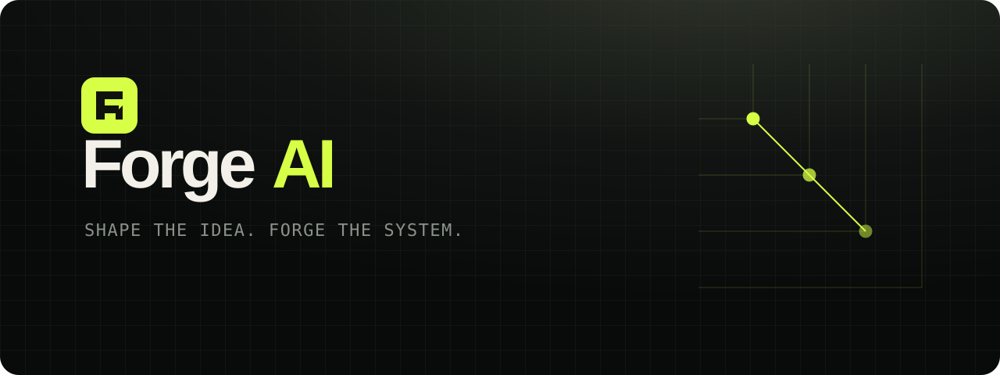
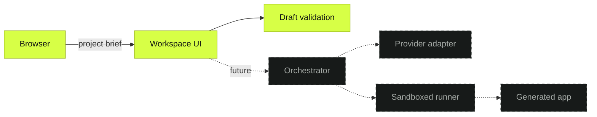

<div align="center">
  
</div>

<p align="center">
  <strong>Forge AI is a pre-alpha, self-hostable workspace intended to turn product briefs into reviewable full-stack application changes.</strong>
</p>

<p align="center">
  <a href="LICENSE"></a>
  <a href=".github/workflows/ci.yml"></a>
  
</p>

> [!IMPORTANT]
> Forge is at **pre-alpha** status. This repository currently contains a working project-brief interface and repository validation pipeline—not an AI generation engine. Provider adapters, persistence, and sandboxed execution are roadmap items.

## Product evidence

The interface below is the running application from this repository, not a concept render. Generation remains visibly unavailable because no provider adapter exists yet.

<!-- Screenshot captured from the running app. Keep this alt text explicit about current status. -->
<p align="center"><em>Verified desktop capture pending repository export. Run <code>npm run dev</code> to inspect the exact interface locally.</em></p>

## What works today

- Responsive project-brief workspace with accessible form controls.
- Stack selection for recording intent; it does not generate a stack yet.
- Honest provider-readiness and disabled-generation states.
- Typed project-draft normalization and validation.
- Local development and production builds with Vite.
- Containerized static deployment with an unprivileged Nginx image.
- Automated linting, type checking, unit tests, build verification, and dependency updates.

## Architecture

Solid boxes are implemented today. Dashed boxes describe the proposed generator boundary.



See [Architecture](docs/architecture.md) for boundaries, data flow, and decision records.

## AI providers

No AI provider is supported in the current release. The intended adapter contract and acceptance checklist live in [Provider integration](docs/provider-integration.md). Providers will only be listed here after their adapter, tests, error handling, and documentation are merged.

| Provider | Status | Credentials |
| --- | --- | --- |
| OpenAI | Planned | Not read by current code |
| Anthropic | Planned | Not read by current code |
| Google Gemini | Planned | Not read by current code |
| OpenRouter | Planned | Not read by current code |
| Local OpenAI-compatible endpoint | Planned | Not read by current code |

## Quick start

Requires Node.js 20.19 or newer and npm 10 or newer.

```bash
git clone <your-fork-or-repository-url> forge-ai
cd forge-ai
cp .env.example .env
npm ci
npm run dev
```

Open `http://localhost:5173`. The provider status and generate button remain inactive by design.

## Local installation

```bash
npm ci
npm run verify
npm run dev
```

Build and inspect the production bundle:

```bash
npm run build
npm run preview
```

## Docker installation

```bash
docker compose up --build
```

Open `http://localhost:8080`. Stop it with `docker compose down`. The image contains only the compiled static workspace; it does not run models or generated code. See [Self-hosting](docs/self-hosting.md).

## Environment variables

The current client has no secrets or runtime environment requirements. `.env.example` documents reserved names for the future server boundary; none are consumed today.

| Variable | Required now | Purpose |
| --- | --- | --- |
| `FORGE_HOST` | No | Reserved server bind address. |
| `FORGE_PORT` | No | Reserved server port. |
| `FORGE_DATA_DIR` | No | Reserved persistent-state directory. |
| `FORGE_WORKSPACE_ROOT` | No | Reserved root for isolated generated workspaces. |
| `FORGE_LOG_LEVEL` | No | Reserved application log level. |

Never prefix provider secrets with `VITE_`; Vite exposes such values to browser code. Provider credentials must eventually remain in a server-side secret store.

## Self-hosting

Today, self-hosting means serving a static, non-authenticated pre-alpha interface. Do not expose it as though it were a multi-user generator.

1. Build with `docker compose build`.
2. Run behind your existing TLS reverse proxy with `docker compose up -d`.
3. Keep the container filesystem read-only and retain the supplied security headers.
4. Pin an immutable image digest before production use.

The complete deployment boundary and upgrade procedure are in [Self-hosting](docs/self-hosting.md).

## Security and sandboxing

Forge currently performs no model calls, shell execution, repository mutation, uploads, or server-side storage. Consequently, **there is no execution sandbox yet**. The Docker container isolates static web serving only and must not be presented as a safe code-execution boundary.

The target model separates orchestration from disposable, least-privilege runners with network-deny defaults, workspace-scoped mounts, resource limits, explicit approvals, and auditable diffs. Read [Security model](docs/security-model.md) and report vulnerabilities through [SECURITY.md](SECURITY.md).

## Current limitations

- No AI provider integration or generated output.
- No backend API, database, authentication, project persistence, or collaboration.
- No command runner, repository writer, preview environment, or execution sandbox.
- Stack choices are UI metadata only.
- Docker serves the static interface and does not add generator capabilities.
- Display fonts require network access unless the browser uses system fallbacks.
- Only the project-draft domain logic currently has automated unit coverage.

## Roadmap

- [x] Verifiable pre-alpha workspace and public repository baseline.
- [ ] Versioned provider interface with one tested provider adapter.
- [ ] Server-side secret handling and streaming generation events.
- [ ] Persistent projects and resumable generation plans.
- [ ] Sandboxed, resource-limited build/test runner with network policy.
- [ ] Reviewable file tree, diffs, checkpoints, and rollback.
- [ ] Generated-app preview with explicit trust boundaries.
- [ ] Multi-user authentication, authorization, and audit records.

Roadmap items are direction, not commitments or completed features.

## Testing

```bash
npm run lint       # ESLint across source and configuration
npm run typecheck  # strict TypeScript project checks
npm test           # Vitest unit suite
npm run build      # production compilation and bundle
npm run verify     # all four checks in sequence
npm audit --audit-level=moderate
```

## Contributing

Issues and focused pull requests are welcome. Start with [CONTRIBUTING.md](CONTRIBUTING.md), follow the [Code of Conduct](CODE_OF_CONDUCT.md), and use conventional commits. Security findings must not be filed publicly; follow [SECURITY.md](SECURITY.md).

## License and acknowledgements

Forge AI is available under the [MIT License](LICENSE).

The repository presentation was informed by the clarity of [OpenClaw](https://github.com/openclaw/openclaw) and [OpenCode](https://github.com/anomalyco/opencode), while the Forge identity, assets, copy, and implementation are original. Thanks to the Vite, TypeScript, Vitest, ESLint, and Nginx communities.
