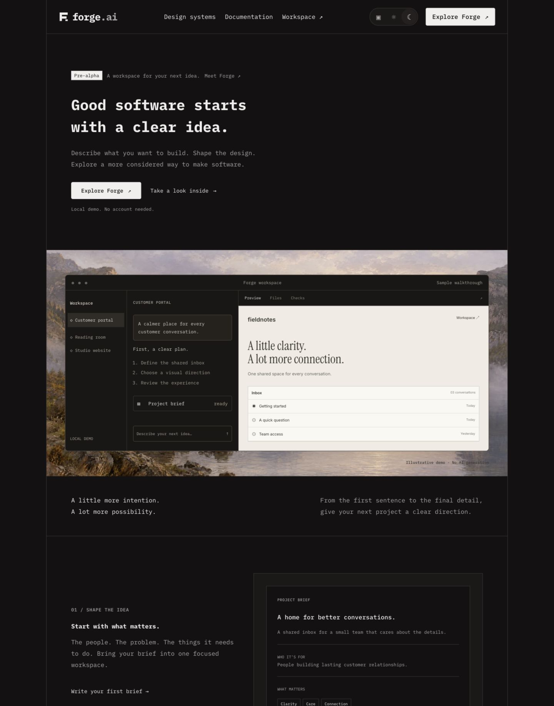
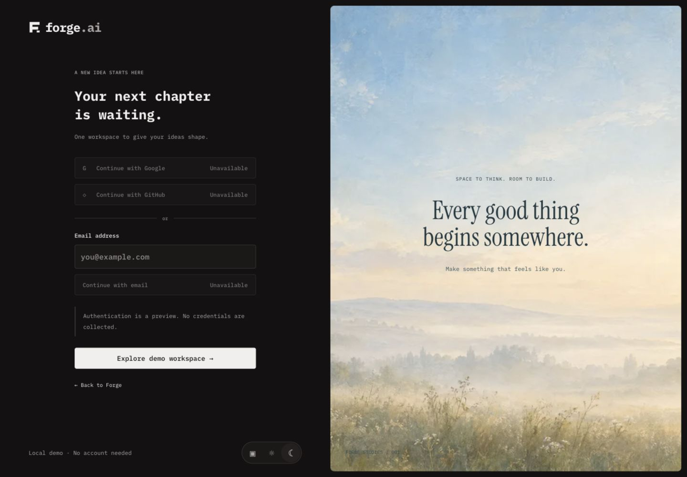
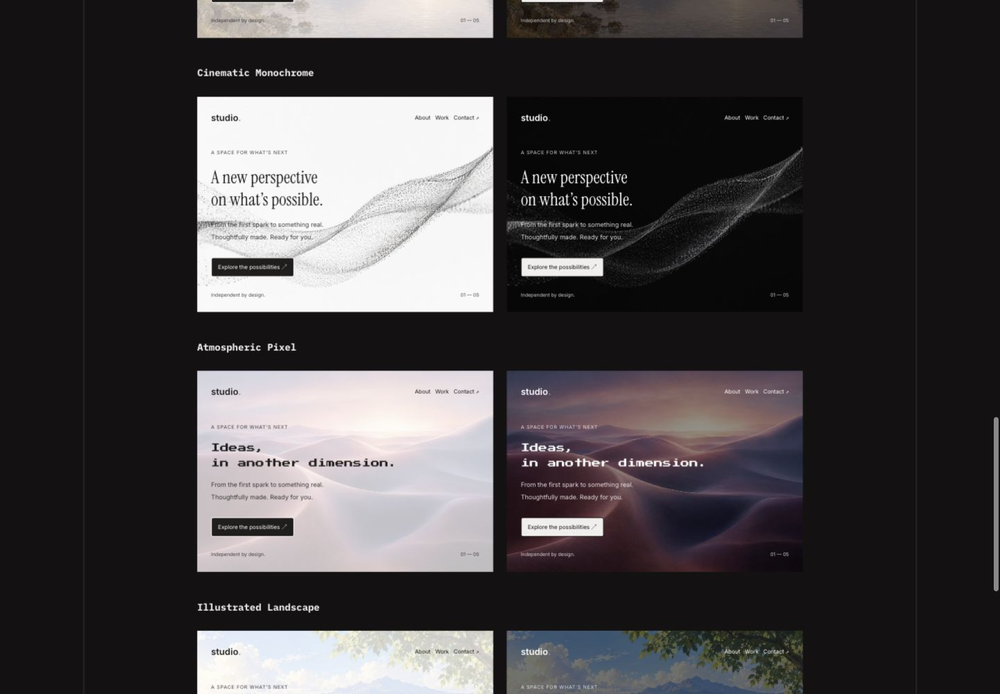
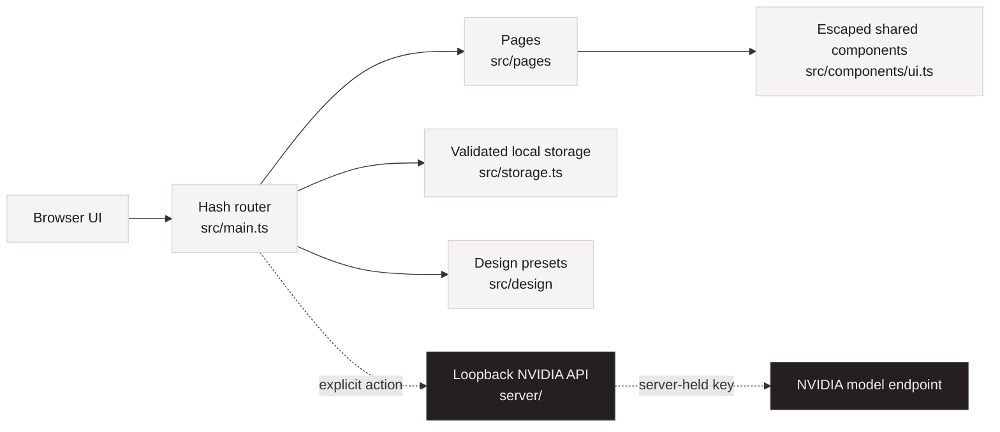

<p align="center">
  
</p>

<p align="center">
  <a href="LICENSE"></a>
  <a href="package.json"></a>
  <a href="docs/security-model.md"></a>
</p>

# Forge AI

Forge AI is a pre-alpha, self-hostable workspace for turning an app idea into a structured brief, design direction, and review plan.

It is intentionally narrow today: a polished Vite + strict TypeScript frontend, browser-local project storage, reusable design presets, deterministic sample walkthroughs, and an optional loopback NVIDIA text-planning API. Forge does not yet authenticate users, generate application files, execute code, run previews, or deploy projects.

## Product Screens

| Landing | Workspace | Design Presets |
| --- | --- | --- |
|  |  |  |

The repository keeps both light and dark captures in [docs/design/screenshots](docs/design/screenshots), with the dark captures featured here to match Forge's primary presentation. Verification notes live in [docs/design/verification.md](docs/design/verification.md).

## Features

- Local app-brief workspace with create, search, reopen, rename, duplicate, delete, undo, and backup flows.
- Five reusable design presets with isolated preview tokens and downloadable ZIP packages.
- System, light, and dark themes applied before paint to avoid theme flash.
- Responsive landing, login preview, workspace, builder tabs, and design-system gallery.
- Deterministic sample walkthroughs clearly labeled as demo fixtures.
- Optional server-side NVIDIA plan generation through a loopback API.
- Static Docker deployment for inspecting the frontend.
- Documented security boundaries, provider-readiness checklist, and contributor workflow.

## Architecture



Read the longer system map in [docs/architecture.md](docs/architecture.md).

## Supported AI Providers

| Provider | Status | Notes |
| --- | --- | --- |
| NVIDIA | Prototype adapter | Optional loopback text-planning API in `server/`; requires a server-side `NVIDIA_API_KEY`. |
| OpenAI-compatible local endpoints | Planned | Needs adapter, SSRF-safe base URL handling, streaming tests, and docs before support is advertised. |
| Other hosted providers | Planned | Must pass the provider acceptance checklist in [docs/provider-integration.md](docs/provider-integration.md). |

## Local Install

Requirements: Node.js 20.19+ and npm 10+.

```bash
git clone https://github.com/shellcat-com/forge-ai.git forge-ai
cd forge-ai
cp .env.example .env.local
npm ci
npm run verify
npm run dev
```

Open `http://127.0.0.1:5173`. The full local UI works without an AI key.

Run the optional planning API in a second terminal:

```bash
npm run api
```

## Docker Install

```bash
docker compose build
docker compose up -d
docker compose ps
```

Open `http://localhost:8080`. The container serves the static frontend only; it does not include the optional planning API or a generated-code sandbox.

## Environment Variables

Copy [.env.example](.env.example) to `.env.local` for local API development.

| Variable | Required | Used by | Description |
| --- | --- | --- | --- |
| `NVIDIA_API_KEY` | Optional | `npm run api` | Server-side key for the NVIDIA prototype adapter. Never expose this through a `VITE_` variable. |
| `FORGE_DAILY_REQUEST_LIMIT` | Optional | `npm run api` | Local request budget for the prototype API process. Resets when the server restarts. |
| `FORGE_DATA_DIR` | Reserved | Future server | Not used by the current application. |
| `FORGE_WORKSPACE_ROOT` | Reserved | Future runner | Not used by the current application. |

## Quick Start

```bash
npm ci
npm run dev
```

Then open Forge, create a local project brief, choose a design preset, and use the review pane to inspect the generated plan. Use the sample walkthrough only as a fixture; sample files and checks are illustrative.

## Self-Hosting

Forge is currently safest as a private static preview. For a small server:

1. Build the image with `docker compose build`.
2. Start it with `docker compose up -d`.
3. Terminate TLS at a maintained reverse proxy.
4. Preserve the supplied security headers.
5. Keep public exposure intentional because there are no accounts or access controls.

See [docs/self-hosting.md](docs/self-hosting.md) for deployment, upgrade, rollback, and production-readiness notes.

## Security Model

Forge treats browser input, provider output, and future generated code as untrusted. Current safeguards include escaped rendering, validated local persistence, no client-side secrets, a loopback-only development API, and an unprivileged static container with a read-only root filesystem.

There is no execution sandbox today. Before Forge writes or runs generated code, the project needs a separate disposable runner with scoped mounts, egress policy, quotas, command review, artifact scanning, and audit events. The full model is documented in [docs/security-model.md](docs/security-model.md).

## Current Limitations

- No authentication, teams, cloud sync, or durable server-side project store.
- No generated application files, live preview runtime, shell access, or deployment engine.
- No production provider abstraction beyond the NVIDIA prototype adapter.
- Browser backups may contain private brief text and should be handled like sensitive files.
- Static Docker hosting demonstrates the interface; it is not a production app-generation service.

## Roadmap

- Formal provider adapter interface with streaming, cancellation, typed errors, and contract tests.
- Server project persistence with account boundaries and migration tooling.
- Reviewable generation jobs that produce diffs instead of mutating files directly.
- Disposable sandbox runner with resource limits and denied-by-default network policy.
- Import/export flows for project backups and preset packages.
- Accessibility and visual regression coverage for core workflows.

## Testing

```bash
npm run lint
npm run typecheck
npm test
npm run build
npm run verify
```

For UI changes, review light and dark themes at 390, 768, and 1440px, keyboard focus, browser zoom, and reduced motion. Keep verification notes in [docs/design/verification.md](docs/design/verification.md) or the relevant milestone report.

## Contributing

Start with [CONTRIBUTING.md](CONTRIBUTING.md), [CODE_OF_CONDUCT.md](CODE_OF_CONDUCT.md), [SECURITY.md](SECURITY.md), and [AGENTS.md](AGENTS.md). Pull requests should stay focused, include tests or visual evidence when behavior changes, and use Conventional Commits.

## License and Acknowledgements

Forge AI is released under the [MIT License](LICENSE). Bundled fonts retain their upstream Open Font License terms in [public/fonts/licenses](public/fonts/licenses).

OpenClaw and OpenCode informed the open-source presentation pattern: prominent identity, quick setup, direct capability boundaries, and privacy/security clarity. Forge's logo, banner, screenshots, copy, and product identity are original to this repository.
