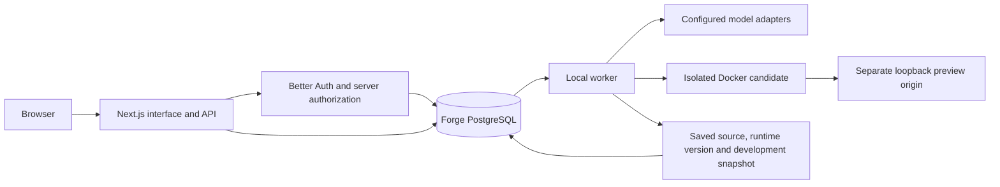

# Architecture

The integration combines the approved Forge interface with the existing Next.js engine. Next.js App Router is the sole web runtime. The original Vite rendering helpers are preserved as escaped public markup under `src/public-renderers`; they are not a second router.

## Implemented boundaries

- `src/components/workspace.tsx`: prompt-first Home, project library, connections and settings.
- `src/components/project-workspace.tsx`: persistent conversation, progress, preview, Monaco, history and review controls.
- `src/app/api`: authenticated project/job/event/file-export/sharing/comment interfaces. Local mode has a configured owner and loopback request checks; hosted mode uses Better Auth sessions and server permissions.
- `src/server/auth`: Better Auth/Drizzle configuration, conditional OAuth/email/dashboard integrations, invitation gate and project access checks.
- `src/server/projects/service.ts`: additive persistence, owner-level submission locks, explicit base revisions, idempotency, project/request caps.
- `worker/index.ts`: durable queue consumption, cancellation, model generation, up to two targeted build repairs, saved revisions and recovery. Idea/Brainstorm/Plan use no build sandbox.
- `src/server/generation`: bounded file batches, protected path validation and relevant source selection. Nested pages, reusable components and server routes are supported. Locked dependencies and trusted runtime configuration remain controlled by Forge.
- `src/server/workspaces`: restricted local Docker execution and preview relay. Generated code does not execute in the Forge web/worker process or receive Forge credentials.
- `server/`: retained separate loopback NVIDIA text-planning service. It is not yet a verified code-generation adapter.

## Current limitations

The worker still uses a global process lock and one active local preview. It pauses that preview during rebuilding and recovers the last working revision after failure. Hosted per-project leases, fencing, independent candidates, E2B execution, R2 artifacts, monetary reservations and deployment adapters remain unimplemented. Hosted generation is gated accordingly.

Legacy SQLite applications and their data snapshots remain local. The starter still includes the historical generic items helper; general application-specific server data modules need further implementation. A successful build and HTTP response are not a complete functional or security verification of generated software.

Source restoration creates a revision and preserves current development data by default. Explicit development-data recovery is separate. Production rollback is not implemented and must never be inferred from source restoration.

## Migration

Migrations 0001–0003 are additive. `scripts/import-engine.mjs` copies explicitly selected local engine projects with an explicit owner, verifies source contents and creates an ignored private recovery file. It preserves project, job and revision IDs; event cursors are destination-local. It does not copy runtime handles or modify the source database. Browser JSON import retains original files and creates archived drafts without generating source.

See [implementation status](implementation-status.md), [cloud status](cloud-setup-status.md), and the [approved plan](implementation-plan.md). Earlier numbered milestone reports describe the original engine at their capture time, not this integration's release status.
