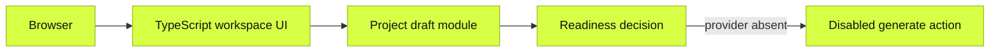
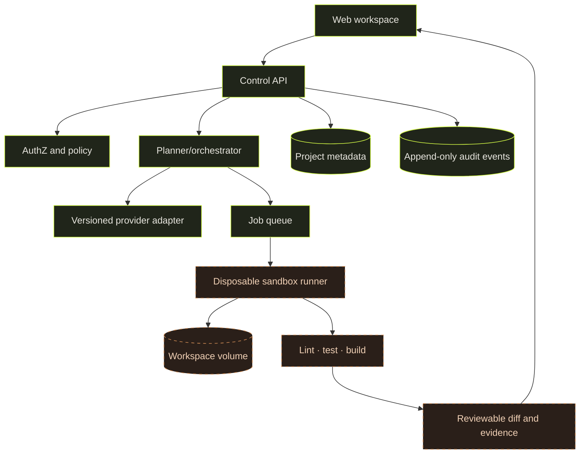
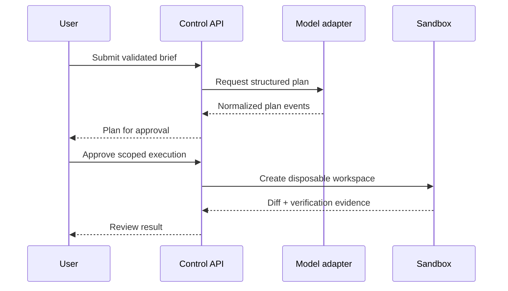

# Architecture

Forge AI currently implements a Next.js project-brief workspace. This page separates the checked-in system from the intended generation system so diagrams do not imply unavailable behavior.

## Current system

Next.js serves the React application during development and production. A production build emits a standalone Node server and locally bundled fonts. The supplied Dockerfile packages that server, but container startup is not yet validated. There is no server API, database, provider connection, background worker, or command execution path.

## Intended system

## Boundary rules

1. Browser clients never receive provider credentials.
2. Provider adapters return a normalized event stream; orchestration does not depend on provider-specific payloads.
3. Generated code and its tools execute only in disposable runners, never in the control API process.
4. Workspaces are scoped per job and mounted with the minimum permissions needed.
5. Network access is denied by default and granted per task through policy.
6. Every mutation is represented as a reviewable diff with command evidence.
7. Project metadata and audit events are distinct from generated workspace contents.

## Proposed request lifecycle

## Decision record

- **Interactive foundation first:** makes status, identity, and contribution workflow reviewable without pretending a generator exists.
- **Adapters behind a contract:** avoids spreading provider payload shapes and retry semantics throughout orchestration.
- **Control plane separate from execution:** reduces the blast radius of generated code.
- **Evidence as output:** generation is incomplete until the resulting diff and relevant checks are visible.

These target decisions require implementation and security review before they become guarantees.
