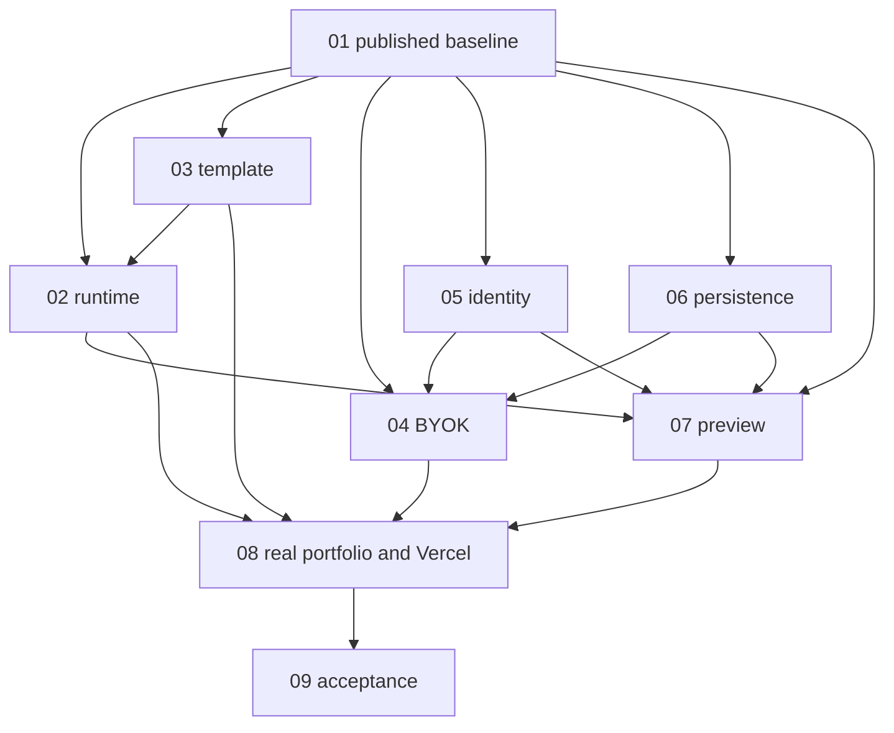

# Demo-delivery coordination

Updated 2026-09-10 UTC. Task 01 is the only baseline/shared-code integrator. Scheduling belongs to the existing Today Coordinator if one is assigned. No new workers or second team were launched by Task 01. Tasks 02–09 below are scope allocations, not claims that sessions started or signed off. The available task inventory showed the prior E0 and E2–E5 tasks idle; no Today Coordinator was found in the inspected inventory.

## Canonical repository and publication

- Verified origin: `https://github.com/shellcat-com/forge-ai.git`; PR target: `master`.
- Canonical integration branch: `codex/demo-delivery-baseline`.
- Published worker starting commit: `881e9ac2b11f8f168cb7849b77c4ee7439e55458`. Create isolated `codex/` worktrees at that exact SHA; do not use the dirty shared `master` checkout.
- Composition parents: reconciled PR #7 `a71519bdffd61b83d24413efc1a53327b4304160` plus source checkpoint `2c98c4f8ea6c2dd4feaef7eee561b373f545b0fe`. Remote `master` was `6a8095ef705e0d1ae319b35c869a03e33540341f` (merged PR #4). Refresh refs before each integration.
- PR dependency: [PR #7](https://github.com/shellcat-com/forge-ai/pull/7) is already an ancestor of this composition. It remains open and untouched. This task targets `master` and therefore includes its changes; review PR #7 first or account for those changes in this PR. No duplicate cherry-pick, merge to master, force-push or branch deletion is authorized.
- Integration PR: PENDING publication. [Task 01 report](../reports/demo-delivery/task-01-baseline.md) records final head, checks, limitations and evidence. The worker starting SHA stays stable when later evidence commits advance the branch.

## Composition and provenance decisions

| Source | Observed state | Canonical treatment |
| --- | --- | --- |
| Shared checkout | `master` at `e8947bb`, substantial uncommitted work | Read only. Engine/runner/templates/tests/source-client bytes matched `2c98c4f`. Preserve unrelated cloud/auth/docs and index. |
| Remote application / PR #4 | Next.js + strict TypeScript, PostgreSQL app schema, Better Auth, provider registry, local Docker worker | Preserve app UI/routes, `src/server`, `worker`, `runtime`, `drizzle`, local source/data history. These implemented paths do not prove RFC hosted/runtime acceptance. |
| PR #7 | Advanced from local `09c193a` to remote `a71519b`; CI passed; master reconciliation already completed | Use its tested Next.js manifests/lock, tooling, CI, historical notices and laboratory separation. No obsolete Vite app resurrection. |
| E2–E5 checkpoint | `2c98c4f`, clean checkpoint worktree | Merge history and retain its newer E1 immutable source bridge, migration 0003, TLS fixes, native repair/HTTP tests, source review client, template/export/recovery and acceptance evidence. |
| E2–E5 worker branches | Some extra untracked/modified dependency copies; checkpoint already composes completed work | Preserve branches and worktrees. Do not replay previously integrated reference commits. Require new owned diff plus report before integrating further work. |
| `/tmp/forge-ai-pr7-resolution` | Separate clean reproduction repository at `a71519b` | Supporting inspected PR #7 checkout, not a new canonical root. |

All original commits and authors survive through merge parents and existing branches. Historical evidence is retained as historical: original manifests may differ from current files after type-only import fixes. Accepted engine SQL 0001/0002, new source SQL 0003, and application SQL 0001–0003 retain exact source bytes. No production and fixture schemas are combined automatically.

Target composition: reuse the Next.js UI and existing application identity choices, integrate RFC E1 durable control/accounting/source guarantees through explicit versioned adapters, then connect real provider/runtime/storage/preview implementations. Until those bridges are tested, application and RFC service remain separate compositions; no cross-authority ID/session/job conversion and no public laboratory routes. The legacy local workflow is preserved, not promoted as the hosted engine by this baseline.

## Worker assignments and exclusive file ownership

Every task owns its named report under `docs/reports/demo-delivery/`. Uncreated reports below are paths, not evidence. Worker implementation PRs initially target `codex/demo-delivery-baseline`, explicitly listing dependencies; Task 01's integration PR targets `master`.

| Task | Exclusive implementation area | Shared requests / dependencies | Report / current state |
| --- | --- | --- | --- |
| 01 coordination | This board, RFC/architecture, `engine/control` except assigned identity, `engine/contracts`, `engine/integration`, application API/worker integration, migrations, manifests/lockfiles, tsconfig/CI | Serial review of all shared changes; signatures and migration allocation below | [task-01-baseline.md](../reports/demo-delivery/task-01-baseline.md); baseline integration |
| 02 runtime | `runner` except template-specific candidate/browser fixtures; `engine/runner-client`; dedicated runtime tests | 03 image/release contract; 01 authorization and shared schemas; 07 runtime routing | `task-02-runtime.md`; awaiting worker assignment, D2 access |
| 03 template | `templates/next-postgres-v1`, template/release tests and candidate scaffold fixtures | 02 image tooling; lockfile edits requested through 01; reference corpus changes reviewed with 09 | `task-03-template.md`; awaiting worker assignment, D7 |
| 04 BYOK/generation | `engine/providers`, `engine/generation`, provider tests; review/reuse `src/server/providers` | 05 credential authorization; 06 secret backend; 01 registry UI boundary, call reservations and migration | `task-04-byok.md`; awaiting worker assignment, D3/D4 |
| 05 identity | `engine/control/identity.ts`, new identity adapter modules and dedicated tests; review/reuse `src/server/auth` | 01 route/schema/session bridge; 04 credential owner checks; 07 revocation | `task-05-identity.md`; awaiting worker assignment, D1 live users |
| 06 persistence/hosting | `engine/artifacts`, new hosted storage/worker configuration, storage/recovery tests and runbooks | 01 database/control/worker shared edits; 04 secret boundary; 08 Vercel deployment configuration | `task-06-persistence.md`; awaiting worker assignment, D5 |
| 07 private preview | `engine/preview`, new gateway modules, preview tests | 01 atomic tickets/DB; 02 exact environment routing; 05 membership; 06 storage | `task-07-preview.md`; awaiting worker assignment, D6 |
| 08 live flow/demo | Next.js UI `src/app`, `src/components`, `src/engine` adaptation and UI tests; public deployment scripts/evidence | API route changes via 01; consumes 02–07; shares hosting config with 06 by request; sole Vercel writer | `task-08-demo.md`; awaiting worker assignment, real dependencies |
| 09 acceptance | `engine/validation`, acceptance harness/ledger and independent tests; open-source readiness docs | Coordinate corpus with 03; validate integrated 02–08; never relabel fixtures | `task-09-validation.md`; awaiting worker assignment, D8 |

Overlapping files are requests, not joint ownership. Submit proposed path, exact contract/diff, dependency commit, migration need and targeted test to Task 01. It records acceptance or revision here before applying. Existing reports/fixture evidence are not overwritten. Architecture changes require an RFC amendment; user direction already resolves BYOK, Vercel and domain scope without another permission round.

## Contract signatures and integration status

These are inspected existing signatures, frozen for baseline consumers. They are not provider/runtime acceptance signatures. Task 01 records any versioned replacement and dependent tests before merging it. **No Task 02–09 implementation sign-off has been received.**

| Contract | Current signature / authority | Required evolution / responsible parties |
| --- | --- | --- |
| Provider v1 | `ProviderAdapter.listModels(signal): Promise<ModelDescriptor[]>`; `validateCredentials(signal): Promise<CredentialStatus>`; `generate(request: GenerationRequest, signal): AsyncIterable<GenerationEvent>` in `engine/contracts/provider.ts` | 04 proposes policy-bound credentials and bounded per-call usage; 01 owns schema/accounting acceptance. Preserve explicit fixture/provider origin. |
| Stage v1 | `StageAdapter.origin: 'fixture'`; `run(input: StageInput, signal): Promise<StageResult>` in `engine/control/stage-adapter.ts` | 01+02+04 must add a validated live result path. Do not widen a literal and treat synthetic verification/cleanup as real. Input retains job/step/operation, lease epoch, digest and source bindings. |
| Source bridge v1 | `storedSourceSchema = {manifest, manifestArtifact, blobs}`; stored candidate has version 1, fixture origin, source and diff reference | 01 owns adoption under native DB state/lease fences; 04 supplies immutable source, 06 versioned objects. |
| Identity v1 | `authorizationUrl(transaction): string`; `exchange(code, verifier, nonceHash, redirectUri): Promise<IdentityClaims>`; current adapter/claims origin is `'fixture'` | 05 proposes real Better Auth/OIDC subject/session mapping; 01 reviews persisted memberships and app/control boundary. No synthetic ID conversion. |
| Object storage | `createOnly(key, bytes): Promise<{version:string}>`; `readVersion(key, version): Promise<Uint8Array>`; evidence `'fixture'|'durable'` in `engine/artifacts/store.ts` | 06 supplies authenticated versioned encrypted backend and restart/tenant/restore proof; flag alone proves nothing. |
| Runtime | `LinuxExecutor.launch(descriptor, attemptId, signal)`; `revokeIngress`; `stopLauncherAndVm`; `wipeAppStorageAndCredentials`; `observe(...): Promise<HostObservation>` in `runner/host/lifecycle.ts` | 02 implements trusted OS adapter; 03 pins image; preserve signed descriptors, attempt IDs, epoch/tombstone cleanup and missing driver default. |
| Broker | `RunnerTransport.send(request: BrokerRequest & {requestId:string}, signal): Promise<unknown>` | 02 preserves authenticated fixed actions; 01 authorizes exact jobs; 07 routes exact environment generations only. |
| Preview | Current pure policy helpers under `engine/preview/policy.ts`; **no implemented atomic gateway contract** | 07 proposes consume-once ticket → scoped session → exact healthy environment; 01 owns DB transaction; 05 revocation and 02 runtime observations required. |
| Application bridge | Existing Next.js `actor`/`projectAccess`, `src/shared/providers`, app jobs and local worker are distinct from RFC contracts | 01 integrates explicit route/identity/job bridge after 04/05/06. No silent parallel production queues. 08 adapts UI only to reviewed contract. |

## Migration allocation

Two namespaces remain distinct. Only Task 01 publishes SQL and changes migration runners. Existing migrations are immutable. Reserved numbers are planning allocations, **not files or applied schema**, and may be reordered by Task 01 before publication if dependencies require it.

| Namespace | Accepted / reserved | Allocation and prerequisite |
| --- | --- | --- |
| `engine/migrations` | 0001 control; 0002 durable control; 0003 immutable source bridge | Preserved exact; apply 0003 only after 0001/0002 in explicit source composition. Default E1 fixture harness continues testing 0001/0002. |
| `engine/migrations` | 0004 reserved | Real identity/membership bridge, 05 proposal integrated by 01 |
| `engine/migrations` | 0005 reserved | Credential metadata and per-call accounting, 04 proposal; follows identity |
| `engine/migrations` | 0006 reserved | Durable artifact/retention metadata, 06 proposal |
| `engine/migrations` | 0007 reserved | Atomic preview tickets/sessions, 07 proposal; follows identity/artifacts |
| `drizzle` | 0001 initial; 0002 runtime version; 0003 unified | Existing application history preserved; `npm run db:migrate` remains its runner. |
| `drizzle` | 0004 reserved | Application-to-engine identity/project bridge, 01 with 05/06; never apply engine SQL using application runner |
| Generated template | Task 03 owns application bootstrap/migrations | Separate generated-app database and image; no control migrations or credentials in guests |

## Dependencies and integration order

Independent implementation/tests may proceed in parallel after publication. Integration order: 03 contract/image inputs; 05 identity and 06 storage foundations; 04 accounting/provider; 02 runtime with 03 pins; 07 preview; 08 live UI/demo; 09 combined acceptance. 09 harness preparation starts earlier. Task 01 integrates each reviewed owned commit with its author intact, checks ancestry plus patch equivalence, records source/integration SHAs, runs affected native/browser checks, then reproduces combined verification in a clean checkout. New worker changes are not implied by historical checkpoint commits.

Integration log: PR #7 + `2c98c4f` composed by merge; no Task 02–09 delivery yet. Shared requests: none received. No scheduler/team was created.

## Decision direction versus acceptance

| Decision | Direction/status | Acceptance still required |
| --- | --- | --- |
| BYOK / D3 | Included, open-source adapters and protected credential flow | Verified adapter/model/endpoint, key authorization/destination checks, actual generated source |
| D4 spend | No paid budget supplied; authorized new spend $0 | Exact prices/token bounds, job/workspace/global caps, uncertain-charge reconciliation, explicit applicable live-test budget |
| Website hosting / D5 subset | Vercel selected for Forge and public portfolio | Account/project access, exact runtime/build configuration and verified public deployment |
| Domain scope | No purchase; platform HTTPS URL direction approved | Actual issued URL and browser/TLS evidence; no custom-domain charge |
| D1 identity | Retain existing Better Auth/Neon application choices | Real owner and two-user cross-tenant/revocation tests; explicit E1 identity bridge |
| D2 execution | Existing hardened Linux/KVM contract retained | Real executor/access, image, containment and cleanup tests; managed alternative needs explicit amendment/evidence |
| D5 durable services | Website choice does not resolve workers, PostgreSQL configuration, objects/KMS/retention/backups | Hosting/access/region/IAM and process-restart plus separate-target restore proof |
| D6 preview | No-purchase arrangement required; private authorization preserved | Actual ticket/session/gateway, exact environment routing and browser site/cookie/revocation tests |
| D7 template | Next.js + strict TypeScript + PostgreSQL required; existing pins are candidate | Exact reviewed bytes, immutable Linux image, offline install/build, app-local DB and clean export evidence |
| D8 operations/release | Public portfolio demonstration included | Named operations/alert owners, measured campaigns and Task 09 sign-off; portfolio does not substitute for A01–A22 |
| Public multi-user generation | Not approved or required for owner demo | Separate product/access/abuse/capacity decision; anonymous portfolio visits grant no engine authority |

## Evidence and report index

Current: [Task 01 baseline](../reports/demo-delivery/task-01-baseline.md). Historical: [PR #7 reconciliation](../reports/pr7-reconciliation.md), [E0](../reports/e0-contracts.md), [E1](../reports/e1-control.md), [E2–E5 checkpoint](../reports/e2-e5-checkpoint.md), [source bridge](../reports/e2-control-integration.md), [E4 repair](../reports/e4-repair-evidence.md), [E3 runtime](../reports/e3-runtime.md), [E5 recovery](../reports/e5-recovery.md), [decision sheet](../reports/engine-decisions.md). The old [acceptance ledger](../reports/evidence/e2-e5/acceptance.json) describes its original checkpoint; it is not a current release attestation. Selected scope never changes a fixture's evidence origin or closes a live gate.
