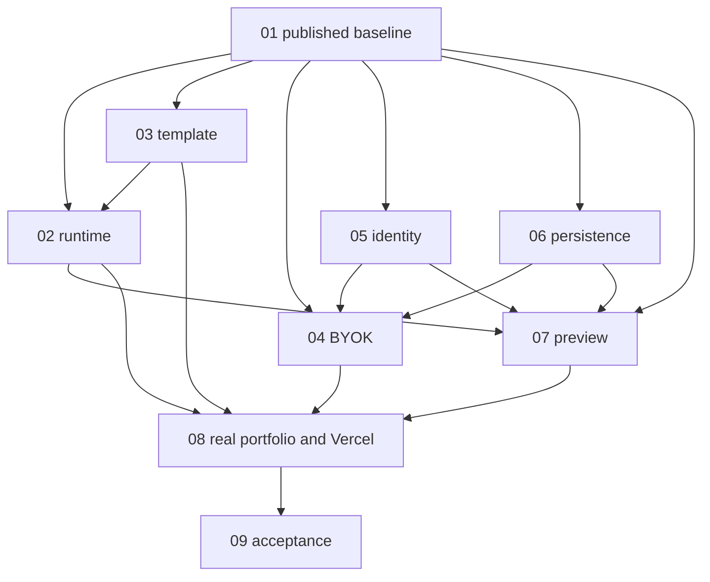

# Demo-delivery coordination

Updated 2026-09-10 UTC. Task 01 is the only baseline/shared-code integrator. Scheduling belongs to the existing Today Coordinator if one is assigned. No new workers or second team were launched by Task 01. Tasks 02–09 are existing user-started sessions in isolated worktrees; their IDs are recorded below. Their reviewed implementation foundations are now integrated; live acceptance is not implied. The prior E0 and E2–E5 tasks are idle; no Today Coordinator was found in the inspected inventory.

## Canonical repository and publication

- Verified origin: `https://github.com/shellcat-com/forge-ai.git`; PR target: `master`.
- Canonical integration branch: `codex/demo-delivery-baseline`.
- Published worker starting commit: `881e9ac2b11f8f168cb7849b77c4ee7439e55458`. Create isolated `codex/` worktrees at that exact SHA; do not use the dirty shared `master` checkout.
- Composition parents: reconciled PR #7 `a71519bdffd61b83d24413efc1a53327b4304160` plus source checkpoint `2c98c4f8ea6c2dd4feaef7eee561b373f545b0fe`. Remote `master` was `6a8095ef705e0d1ae319b35c869a03e33540341f` (merged PR #4). Refresh refs before each integration.
- PR dependency: [PR #7](https://github.com/shellcat-com/forge-ai/pull/7) is already an ancestor of this composition. It was merged externally while this task ran: current `master` is `42a376387835c2d7140b6c484c3517fe466714eb`. Task 01 did not merge or close it. An ancestry-only merge (`591f87c`) records that base without changing source bytes. This task targets `master`; PR #7 is now a satisfied dependency. No duplicate cherry-pick, merge to master, force-push or branch deletion is authorized.
- Integration PR: [draft PR #8](https://github.com/shellcat-com/forge-ai/pull/8). Frozen combined source commit: `4dacd0255e4a04648424eb0b0044c6658b46a014`. Original baseline reproduction at `591f87c7a2e9e8f8f18b356852e922f2d3c1bf19` remains historical; final combined reproduction is tracked in the report. [Task 01 report](../reports/demo-delivery/task-01-baseline.md) records final head, checks, limitations and evidence. The worker starting SHA stays stable when later evidence commits advance the branch.

## Composition and provenance decisions

| Source | Observed state | Canonical treatment |
| --- | --- | --- |
| Shared checkout | `master` at `e8947bb`, substantial uncommitted work | Read only. Engine/runner/templates/tests/source-client bytes matched `2c98c4f`. Preserve unrelated cloud/auth/docs and index. |
| Remote application / PR #4 | Next.js + strict TypeScript, PostgreSQL app schema, Better Auth, provider registry, local Docker worker | Preserve app UI/routes, `src/server`, `worker`, `runtime`, `drizzle`, local source/data history. These implemented paths do not prove RFC hosted/runtime acceptance. |
| PR #7 | Advanced from local `09c193a` to remote `a71519b`; CI passed; master reconciliation already completed | Use its tested Next.js manifests/lock, tooling, CI, historical notices and laboratory separation. No obsolete Vite app resurrection. |
| E2–E5 checkpoint | `2c98c4f`, clean checkpoint worktree | Merge history and retain its newer E1 immutable source bridge, migration 0003, TLS fixes, native repair/HTTP tests, source review client, template/export/recovery and acceptance evidence. |
| E2–E5 worker branches | Some extra untracked/modified dependency copies; checkpoint already composes completed work | Preserve branches and worktrees. Do not replay previously integrated reference commits. Require new owned diff plus report before integrating further work. |
| `/tmp/forge-ai-pr7-resolution` | Separate clean reproduction repository at `a71519b` | Supporting inspected PR #7 checkout, not a new canonical root. |

All original commits and authors survive through merge parents and existing branches. Historical evidence is retained as historical: original manifests may differ from current files after type-only import fixes. Accepted engine SQL 0001/0002, new source SQL 0003, and application SQL 0001–0003 retain exact source bytes. No production and fixture schemas are combined automatically.

Target composition: reuse the Next.js UI and existing application identity choices, integrate RFC E1 durable control/accounting/source guarantees through explicit versioned adapters, then connect real provider/runtime/storage/preview implementations. Until those bridges are tested, application and RFC service remain separate compositions; no cross-authority ID/session/job conversion and no public laboratory routes. The legacy local workflow is preserved, not promoted as the hosted engine by this baseline.

## Worker assignments and exclusive file ownership

Every task owns its named report under `docs/reports/demo-delivery/`. Uncreated reports below are paths, not evidence. Worker implementation PRs initially target `codex/demo-delivery-baseline`, explicitly listing dependencies; Task 01's integration PR targets `master`.

| Task | Exclusive implementation area | Shared requests / dependencies | Report / current state |
| --- | --- | --- | --- |
| 01 coordination | This board, RFC/architecture, `engine/control` except assigned identity, `engine/contracts`, `engine/integration`, application API/worker integration, migrations, manifests/lockfiles, tsconfig/CI | Serial review of all shared changes; signatures and migration allocation below | [task-01-baseline.md](../reports/demo-delivery/task-01-baseline.md); baseline integration |
| 02 runtime | `runner` except template-specific candidate/browser fixtures; `engine/runner-client`; dedicated runtime tests | 03 image/release contract; 01 authorization and shared schemas; 07 runtime routing | [task-02-runtime.md](../reports/demo-delivery/task-02-runtime.md); integrated foundation; D2 access |
| 03 template | `templates/next-postgres-v1`, template/release tests and candidate scaffold fixtures | 02 image tooling; lockfile edits requested through 01; reference corpus changes reviewed with 09 | [task-03-template.md](../reports/demo-delivery/task-03-template.md); integrated foundation; D7 |
| 04 BYOK/generation | `engine/providers`, `engine/generation`, provider tests; review/reuse `src/server/providers` | 05 credential authorization; 06 secret backend; 01 registry UI boundary, call reservations and migration | [task-04-byok.md](../reports/demo-delivery/task-04-byok.md); integrated foundation; D3/D4 |
| 05 identity | `engine/control/identity.ts`, new identity adapter modules and dedicated tests; review/reuse `src/server/auth` | 01 route/schema/session bridge; 04 credential owner checks; 07 revocation | [task-05-identity.md](../reports/demo-delivery/task-05-identity.md); integrated foundation; D1 live users |
| 06 persistence/hosting | `engine/artifacts`, new hosted storage/worker configuration, storage/recovery tests and runbooks | 01 database/control/worker shared edits; 04 secret boundary; 08 Vercel deployment configuration | [task-06-persistence.md](../reports/demo-delivery/task-06-persistence.md); integrated foundation; D5 |
| 07 private preview | `engine/preview`, new gateway modules, preview tests | 01 atomic tickets/DB; 02 exact environment routing; 05 membership; 06 storage | [task-07-preview.md](../reports/demo-delivery/task-07-preview.md); integrated foundation; D6 |
| 08 live flow/demo | Next.js UI `src/app`, `src/components`, `src/engine` adaptation and UI tests; public deployment scripts/evidence | API route changes via 01; consumes 02–07; shares hosting config with 06 by request; sole Vercel writer | [task-08-live-demo.md](../reports/demo-delivery/task-08-live-demo.md); integrated foundation; real dependencies |
| 09 acceptance | `engine/validation`, acceptance harness/ledger and independent tests; open-source readiness docs | Coordinate corpus with 03; validate integrated 02–08; never relabel fixtures | [task-09-acceptance.md](../reports/demo-delivery/task-09-acceptance.md); integrated foundation; D8 |

Overlapping files are requests, not joint ownership. Submit proposed path, exact contract/diff, dependency commit, migration need and targeted test to Task 01. It records acceptance or revision here before applying. Existing reports/fixture evidence are not overwritten. Architecture changes require an RFC amendment; user direction already resolves BYOK, Vercel and domain scope without another permission round.

## Contract signatures and integration status

These are the original baseline signatures with explicitly recorded implementation evolution. They are not provider/runtime acceptance signatures. Task 01 records any versioned replacement and dependent tests before merging it. **Reviewed foundation code is integrated through `4dacd02`; production composition and live acceptance remain unsigned.** Exact baseline file hashes: [contract signatures](../reports/evidence/task-01/contract-signatures.json).

| Contract | Current signature / authority | Required evolution / responsible parties |
| --- | --- | --- |
| Provider v1 | `ProviderAdapter.listModels(signal): Promise<ModelDescriptor[]>`; `validateCredentials(signal): Promise<CredentialStatus>`; `generate(request: GenerationRequest, signal): AsyncIterable<GenerationEvent>` in `engine/contracts/provider.ts` | 04 proposes policy-bound credentials and bounded per-call usage; 01 owns schema/accounting acceptance. Preserve explicit fixture/provider origin. |
| Stage v1 | `StageAdapter.origin: 'fixture'`; `run(input: StageInput, signal): Promise<StageResult>` in `engine/control/stage-adapter.ts` | 01+02+04 must add a validated live result path. Do not widen a literal and treat synthetic verification/cleanup as real. Input retains job/step/operation, lease epoch, digest and source bindings. |
| Source bridge v1 | `storedSourceSchema = {manifest, manifestArtifact, blobs}`; stored candidate has version 1, fixture origin, source and diff reference | 01 owns adoption under native DB state/lease fences; 04 supplies immutable source, 06 versioned objects. |
| Identity v1 | `authorizationUrl(transaction): string`; `exchange(code, verifier, nonceHash, redirectUri): Promise<IdentityClaims>`; adapter/claims origin now supports `'fixture' | 'oidc'`; fixture startup remains explicit | 05 proposes real Better Auth/OIDC subject/session mapping; 01 reviews persisted memberships and app/control boundary. No synthetic ID conversion. |
| Object storage | `createOnly(key, bytes): Promise<{version:string}>`; `readVersion(key, version): Promise<Uint8Array>`; evidence `'fixture'|'durable'` in `engine/artifacts/store.ts` | 06 supplies authenticated versioned encrypted backend and restart/tenant/restore proof; flag alone proves nothing. |
| Runtime | `LinuxExecutor.launch(descriptor, attemptId, signal)`; `revokeIngress`; `stopLauncherAndVm`; `wipeAppStorageAndCredentials`; `observe(...): Promise<HostObservation>` in `runner/host/lifecycle.ts` | 02 implements trusted OS adapter; 03 pins image; preserve signed descriptors, attempt IDs, epoch/tombstone cleanup and missing driver default. |
| Broker | `RunnerTransport.send(request: BrokerRequest & {requestId:string}, signal): Promise<unknown>` | 02 preserves authenticated fixed actions; 01 authorizes exact jobs; 07 routes exact environment generations only. |
| Preview | Current pure policy helpers under `engine/preview/policy.ts`; **no implemented atomic gateway contract** | 07 proposes consume-once ticket → scoped session → exact healthy environment; 01 owns DB transaction; 05 revocation and 02 runtime observations required. |
| Application bridge | Existing Next.js `actor`/`projectAccess`, `src/shared/providers`, app jobs and local worker are distinct from RFC contracts | 01 integrates explicit route/identity/job bridge after 04/05/06. No silent parallel production queues. 08 adapts UI only to reviewed contract. |

## Migration allocation

Two namespaces remain distinct. Only Task 01 publishes SQL and changes migration runners. Existing migrations are immutable. Reserved numbers are planning allocations, **not files or applied schema**, and may be reordered by Task 01 before publication if dependencies require it.

| Namespace | Accepted / reserved | Allocation and prerequisite |
| --- | --- | --- |
| `engine/migrations` | 0001 control; 0002 durable control; 0003 immutable source bridge | Preserved exact; apply 0003 only after 0001/0002 in explicit source composition. Default E1 fixture harness continues testing 0001/0002. |
| `engine/migrations` | 0004 reserved | Real identity/membership bridge, 05 proposal integrated by 01 |
| `engine/migrations` | 0005 reserved | Credential metadata and per-call accounting, 04 proposal; follows identity |
| `engine/migrations` | 0006 reserved | Durable artifact/retention metadata, 06 proposal |
| `engine/migrations` | 0007 reserved | Atomic preview tickets/sessions, 07 proposal; follows identity/artifacts |
| `drizzle` | 0001 initial; 0002 runtime version; 0003 unified | Existing application history preserved; `npm run db:migrate` remains its runner. |
| `drizzle` | 0004 reserved | Application-to-engine identity/project bridge, 01 with 05/06; never apply engine SQL using application runner |
| Generated template | Task 03 owns application bootstrap/migrations | Separate generated-app database and image; no control migrations or credentials in guests |

## Dependencies and integration order

Independent implementation/tests may proceed in parallel after publication. Integration order: 03 contract/image inputs; 05 identity and 06 storage foundations; 04 accounting/provider; 02 runtime with 03 pins; 07 preview; 08 live UI/demo; 09 combined acceptance. 09 harness preparation starts earlier. Task 01 integrates each reviewed owned commit with its author intact, checks ancestry plus patch equivalence, records source/integration SHAs, runs affected native/browser checks, then reproduces combined verification in a clean checkout. New worker changes are not implied by historical checkpoint commits.

Integration log: PR #7 + `2c98c4f` composed in `881e9ac`; worker SHA recorded in `90d841a`; isolated browser harness in `d4f7b50`; newly merged master ancestry recorded without source changes in `591f87c`. Task 09 independent harness/evidence commits `2437ec3` and `4fa7dc2` integrated with original authorship in `d3244f7`; [PR #10](https://github.com/shellcat-com/forge-ai/pull/10) remains the source review. This is early harness preparation, not final release acceptance. Other deliveries remain under review. Shared requests are tracked in the follow-up log below. No scheduler/team was created.

## Decision direction versus acceptance

| Decision | Direction/status | Acceptance still required |
| --- | --- | --- |
| BYOK / D3 | Included, open-source adapters and protected credential flow | Verified adapter/model/endpoint, key authorization/destination checks, actual generated source |
| D4 spend | No paid budget supplied; authorized new spend $0 | Exact prices/token bounds, job/workspace/global caps, uncertain-charge reconciliation, explicit applicable live-test budget |
| Website hosting / D5 subset | Vercel selected for Forge and public portfolio | Account/project access, exact runtime/build configuration and verified public deployment |
| Domain scope | No purchase; platform HTTPS URL direction approved | Actual issued URL and browser/TLS evidence; no custom-domain charge |
| D1 identity | Retain existing Better Auth/Neon application choices | Real owner and two-user cross-tenant/revocation tests; explicit E1 identity bridge |
| D2 execution | Existing hardened Linux/KVM contract retained | Real executor/access, image, containment and cleanup tests; managed alternative needs explicit amendment/evidence |
| D5 durable services | Website choice does not resolve workers, PostgreSQL configuration, objects/KMS/retention/backups | Hosting/access/region/IAM and process-restart plus separate-target restore proof |
| D6 preview | No-purchase arrangement required; private authorization preserved | Actual ticket/session/gateway, exact environment routing and browser site/cookie/revocation tests |
| D7 template | Next.js + strict TypeScript + PostgreSQL required; existing pins are candidate | Exact reviewed bytes, immutable Linux image, offline install/build, app-local DB and clean export evidence |
| D8 operations/release | Public portfolio demonstration included | Named operations/alert owners, measured campaigns and Task 09 sign-off; portfolio does not substitute for A01–A22 |
| Public multi-user generation | Not approved or required for owner demo | Separate product/access/abuse/capacity decision; anonymous portfolio visits grant no engine authority |

## Evidence and report index

Current: [Task 01 baseline](../reports/demo-delivery/task-01-baseline.md). Historical: [PR #7 reconciliation](../reports/pr7-reconciliation.md), [E0](../reports/e0-contracts.md), [E1](../reports/e1-control.md), [E2–E5 checkpoint](../reports/e2-e5-checkpoint.md), [source bridge](../reports/e2-control-integration.md), [E4 repair](../reports/e4-repair-evidence.md), [E3 runtime](../reports/e3-runtime.md), [E5 recovery](../reports/e5-recovery.md), [decision sheet](../reports/engine-decisions.md). The old [acceptance ledger](../reports/evidence/e2-e5/acceptance.json) describes its original checkpoint; it is not a current release attestation. Selected scope never changes a fixture's evidence origin or closes a live gate.

## Active worker handoff and shared-request log

All workers received canonical SHA `881e9ac2b11f8f168cb7849b77c4ee7439e55458` and instructions to consult this latest branch document: the first merge commit predates publication metadata. Readable Git database/main integration checkout: `/tmp/forge-task01-clean-reproduction`. Shared Documents Git reads have hung; workers use isolated worktrees from this readable clone. Do not repair/delete Codex-internal refs or overwrite shared working files. Baseline checks remain recorded at `591f87c`/`e533afe`; Task 09 independent harness is now integrated in `d3244f7` (13 focused tests, 21 artifact hashes and 304 source hashes verified). Combined clean reproduction after implementation integration remains pending.

| Task | Session ID | Isolated branch/worktree | Current handoff |
| --- | --- | --- | --- |
| 02 | `01a08981-52bb-7970-9bae-d28c6f66d418` | `codex/task-02-runtime`, `/tmp/forge-task02-runtime` | PR #16 / `f276d54` integrated in `27191e8`; default-disabled runtime, E1 authority remains 01-owned |
| 03 | `01a08981-9134-73b1-862b-126b1984ff5e` | `codex/task-03-template`, `/tmp/forge-task03-template` | PR #13 / `b3fb6f6` integrated in `b40486b`; candidate image/template release remains open |
| 04 | `01a08981-bd53-7f60-9e5b-ae5d715cfdf2` | `codex/task-04-byok`, `/tmp/forge-task04-byok` | PR #15 / `fce0a18`–`bd8d623` integrated via `6c36784`/`ab9fa7b`; 0005/global gate/cleanup integration remains open |
| 05 | `01a08981-f80b-7921-84f9-19f1b55abef7` | `codex/task-05-identity`, `/tmp/forge-task05-identity` | PR #11 / `c4236ba`–`c20f3ae` integrated via `417874d`/`46ff21c`; hosted plugin/composition/0004 and lifecycle hooks pending |
| 06 | `01a08982-22d5-7611-8aa3-62d4d0467618` | `codex/task-06-persistence`, `/tmp/forge-task06-persistence` | PR #12 / `aa1a8c1`–`70cff26` integrated via `ae0db48`/`7b80108`; 0006/adoption composition remains open |
| 07 | `01a08982-57f5-7b93-8f1a-663e051eb871` | `codex/task-07-private-preview`, `/tmp/forge-task07-preview` | PR #14 / `edcd3c1` integrated in `b2a3493`; reviewed lock/race fixes, unmounted gateway/0007 proposal |
| 08 | `01a08982-8039-7ad0-b1e9-289d23704a0a` | `codex/task-08-live-demo`, `/tmp/forge-task08-live-demo` | PR #9 / `7bcc738` integrated in `4dacd02`; publisher and public availability page, no generated portfolio |
| 09 | `01a08982-d093-70e0-9a85-0db88a6413d4` | `codex/task-09-acceptance`, `/tmp/forge-task09-acceptance` | Source PR #10 / `4fa7dc2`; harness integrated in `d3244f7`; final integrated/live audit blocked |

Scoped delegations supersede the broader ownership defaults only as follows:

- 03 may edit `templates/next-postgres-v1/package.json` and its lockfile, template configs/release/policy/tests, and add the portfolio brief to `tests/harness/reference-apps.ts`. Existing task-board/Pomodoro behavior remains unchanged; coordinate corpus digest impact with 09. Root manifests and general validation stay outside this delegation.
- 05 may edit only the auth bootstrap/login/callback/session-label branches of `engine/control/http.ts`, alongside its identity files/tests. Exact cross-site top-level GET callback handling, bounded OAuth code, duplicate-parameter rejection and narrowly scoped bootstrap SameSite exception must retain state/nonce/PKCE/CSRF defenses. Normal mutation/session policies remain. `index.ts`, `config.ts`, other HTTP routes and canonical SQL remain 01-owned. Proposed identity provenance `'fixture'|'oidc'` is not live job/stage authorization.
- 07 owns new preview control/gateway modules and proposal SQL outside `engine/migrations`. 01 has not published 0007. Initial review requires session/ticket/route lock-order fixes for logout/revoke/consume/renew, removal of concurrent SHARE-to-UPDATE renewal deadlocks, recomputed idle grants and serialization with cancellation/security/policy revocation. Native concurrency and privilege tests are required before integration.
- 08 may implement `engine/publishing`, dedicated publisher scripts/tests, UI adaptation and an explicit opt-in website-only unavailable fallback. The canonical Next.js app remains the main hosting path; fallback publication is not live builder or generated-portfolio acceptance. Narrow metadata sanitization is delegated for `docs/design/assets.json`, `public/art/provenance.json`, the linked `skills/forge-project-design/references/assets.json` and three provider-account video URLs in `docs/design/research.md`, preserving asset bytes/hashes and safe attribution. `scripts/prepare-art.mjs` may reject sanitized provider-origin-only sources before fetching; no regeneration/download is authorized by this delegation. Rights evidence and any archive removal require a bounded reviewed proposal; no history rewrite or broad cleanup.

Shared contracts in review (direction accepted, code/acceptance not signed off):

| Request | Direction / required review |
| --- | --- |
| 02/03 image bundle | Agreed digest composition binds exact kernel/rootfs/Firecracker/jailer/seccomp/cache/supervisor/guest-agent bytes, `imageInputsDigest` and independent `templateInputsDigest`. Exclude final E2 `templateDigest` from the image preimage: that catalog already includes `imageDigest`, so including it would create a hash cycle. Final runtime configuration and signed descriptor bind both digests. Preserve `sha256:<hex>` wire format. Selected transport has vsock and no NIC; external browser harness remains unavailable without actual separate isolation. Exact schema/materialization tests and live image acceptance remain pending. |
| 04 accounting | Immutable scope/job/step/epoch/request/credential revision/destination/price/token terms; atomic reserve before dispatch; duplicate never dispatches twice; scoped idempotent settlement; retain unknown liabilities. Late trusted usage can settle without restoring job authority. Deliver exact SQL/ports/tests for 0005 integration. |
| 05 credentials/identity | Owner authorization callback and metadata mutation share the same `db.session` transaction. Reuse existing Better Auth authority; exact compatible OIDC plugin/version and root configuration require 01 review. No verified live issuer/users are available. |
| 06 versioned storage | Existing object API retained; optional PostgreSQL encrypted transport is a self-hosted implementation option, not a hosted service selection. Proposed separate `forge_objects` schema/roles in 0006. Adoption/orphan serialization must share E1's actual database and transaction/lock domain, with native race/restore tests. |
| 07 private gateway | Exact generation and authenticated runtime routing; atomic ticket/session lifecycle through canonical roles. No current public/private hostname or live route is accepted. Revised proposal uses parent authorization before ticket locks, preview UPDATE from the outset, settings/project/job locks and post-renewal idle grants. Reported native tests remain supporting evidence until reviewed. Cross-task identity-operator/settings/workspace lock inversion is an outstanding integration review item; native races with operator revocation and canonical worker/reconciler are required. |
| 09 package/provenance audit | Positive root package allowlist proposal requested after dry-run found research/evidence archives and account metadata. `private:true` remains and no npm publication occurred. Digest/test canary scanner hits are not real credentials. Distinguish personal path metadata from actual private material; preserve historical evidence hashes. |

No new paid budget, runtime/worker/object/KMS service, domain purchase or live acceptance has been authorized by these implementation directions. Task 08 separately reports read-only Vercel account/capacity preflight and plans an explicit website-only unavailable fallback under its existing hosting authorization; this is not a published URL or generated-portfolio acceptance. Completed worker commits will be reviewed and integrated in dependency order; the baseline remains unchanged until then.

Verification resource coordination: baseline dependencies at `/tmp/forge-task01-clean-reproduction/node_modules` are frozen read-only while worker symlinks use them. Do not install, delete or replace that tree. Supporting worker checks must identify shared dependencies; combined clean reproduction follows reviewed integration. Local disk pressure can block a build without blocking independent implementation or accurately labeled publication.

Task 09 integration validation: `vitest run tests/engine/delivery-evidence.test.ts --maxWorkers=1` passed 13/13 with frozen baseline dependencies. SHA-256 verification matched all 21 retained artifacts and all 304 source inventory entries plus its canonical digest. Gitleaks review of added files found two prose/command false positives in its report (the known baseline Git commit argument and “signed/private”), no credential identified. README now links the committed setup/readiness guide and uses `npm ci`. These checks do not replace the required final clean combined verification.

### Reviewed delivery integrations

| Source | Integration | Validation and remaining dependencies |
| --- | --- | --- |
| 09 `2437ec3`, `4fa7dc2` / PR #10 | `d3244f7` | 13 validator tests, 21 artifact hashes/304 source hashes; independent harness only. |
| 05 `c4236ba` / PR #11 | `417874d` | Node24 source CI passed run34437628422; 15 source/evidence hashes verified; 25 OIDC tests plus 13 validator tests pass together locally. Local targeted checks use frozen dependencies. Hosted authority composition, lifecycle hooks and real identities remain open. |
| 09 `10e1962` follow-up | `b6e268f` | 23 retained artifact hashes verified; independent anonymous availability-page observation only. Its 304-file source inventory remains bound to the earlier audited commit and must not be treated as the integrated source digest. |

These are authored-history merges into the integration branch. GitHub automatically marks a source PR merged when its base branch contains the merged head; Task 01 has not called a PR merge/close action or changed `master`. PR #8 remains draft. No shared SQL migration or hosted configuration is enabled by the identity foundation.

| Additional source | Integration | Review evidence / acceptance boundary |
| --- | --- | --- |
| 03 `b3fb6f6` / PR #13 | `b40486b` | CI34437962419 passed; 26 artifact + 24 source hashes verified; 19 TS + 5 Python tests pass locally. Raw-log whitespace preserved; D7 candidate, not Linux runtime acceptance. |
| 04 `fce0a18`, `641ad33`, `bd8d623` / PR #15 | `6c36784`, `ab9fa7b` | CI34438040481 passed; 15 source + final 6 artifact hashes verified; 99 provider/source tests pass locally. Legacy partial uniqueness retained. Shared0005/global gate/cleanup remain unconnected. |
| 05 `c20f3ae` / PR #11 | `46ff21c` | CI34437879134 passed; 17 updated hashes verified; 26 OIDC protocol tests pass locally. Root-issuer spelling fix, unchanged operator lock logic. |
| 06 `aa1a8c1`, `70cff26` / PR #12 | `ae0db48`, `7b80108` | CI34437822961 and34438059505 passed; final18 source/evidence hashes verified;5 encryption/config tests pass locally. Same-worker-transaction adoption still required before canonical0006/live use. |
| 09 `1fbcc99`, `f36e9c8` | `b6f8dfb` | 25 artifact hashes verified; historical304-file inventory remains bound to its original source. |

Task02 review remains open for privileged jail-directory ancestor/ownership/exclusive-create checks and guest expired-RPC rejection before handling. These are independent code corrections, not reasons to claim containment accepted. Task07/08 stable deliveries await their dependency-ordered integration. All local integration unit checks above use the frozen baseline dependency tree; final clean combined reproduction remains pending. No root package/lock or canonical SQL migration changed during these merges.

## Current combined handoff — supersedes earlier pending-delivery observations

Frozen source `4dacd0255e4a04648424eb0b0044c6658b46a014` contains every reviewed Task02–08 foundation and Task09 harness through `f36e9c8`. Earlier follow-up paragraphs are a chronological review log, not current delivery status. The original `881e9ac` worker starting point stays immutable. Task01 requested the existing Task09 session's final independent audit against this combined SHA; no second team was created.

| Final source | Authored-history integration | Local review before combined reproduction |
| --- | --- | --- |
| 02 `f276d540ee111a47e0ab6ee8147b43caab914445` / PR16 | `27191e8` | 17 source + 7 artifact hashes; 27 runtime TS and 21 Python simulations pass; added-file secret scan clear. Privileged jail ancestors and expired guest RPC fixes reviewed. No Linux/KVM execution. |
| 07 `edcd3c16bac857ea5c1cd40fdf8fbeba75f11c43` / PR14 | `b2a3493` | 15 source + 9 artifact hashes; 15 host/hostname/policy tests pass; added-file scan clear. Local browser/operator concurrency rerun belongs to combined verification. |
| 08 `7bcc738a65fe6e54150ba0738196b57801d044e4` / PR9 | `4dacd02` | 20 artifact hashes/lengths; 28 publishing tests pass; added-file scan clear; retained mobile-light/desktop-dark screenshots inspected. Metadata edits preserve all art bytes. |

Source PRs can be automatically marked merged when their base receives these commits; no GitHub PR merge/close operation or master mutation was performed. The sole integration deliverable remains draft PR8, base `master`.

Accepted directions have these separate unresolved integration dependencies:

1. **01 identity composition / 0004:** install and configure the reviewed compatible Better Auth OIDC provider only with its schema/lifecycle hooks, static client and exact issuer; connect real subject/membership/session revocation to E1. No second identity authority or fixture-ID conversion.
2. **01 accounting / 0005:** actual `CallDispatchGate.lockAndAuthorize(c, terms)` must lock current global/workspace/project/job/step authority, lease, credential revision, policy and spend. Integrate the whole-job/global envelope and retain `reserved` as well as dispatched/uncertain call liabilities during cleanup. The reviewed proposal preserves legacy uniqueness but is not safe to publish alone.
3. **01 objects / 0006:** `lockObjectForAdoption(c: PoolClient, ref)` must run in the actual leased worker adoption transaction before the artifact insert. Same-database advisory locks, fresh authorization, retention and backup key availability remain requirements. Local separate-database restore does not prove separate-host recovery.
4. **01 live source/runner composition:** implement fresh E1 `authority(descriptor)` and validated live `StageAdapter` result/adoption. Bind both final template and image digests; release/materialize the real image and separately isolated external checker before enabling dispatch. Current fixture source/repair path stays explicit.
5. **01 preview / 0007:** mount reviewed control/gateway handlers only after canonical identity/schema/worker teardown integration and a selected real private TLS/protection arrangement. Task07 local Chromium and native races are supporting evidence; Vercel public website hosting does not authorize private preview ingress.
6. **03/08 portfolio release:** `next-postgres-portfolio-static-v1` remains an unregistered proposed profile. The portfolio brief is not a release template. Register reviewed `PublicationAuthority`, bind an actual approved provider job and complete build output, then publish/recheck the generated artifact. Existing Next/PostgreSQL task-board acceptance remains required.
7. **09 audit/distribution:** final source audit and current package inventory; old positive allowlist proposal omits new runtime files and must not be applied. Root `private:true`, package/lock and canonical SQL bytes remain unchanged. Git checkout plus lockfile is the reproducible source distribution; no npm publication is claimed.

Task08 has published [a public availability website](https://forge-ai-demo-omega.vercel.app), independently observed by Task09. It explicitly has no hosted builder, sign-in, key submission, private preview or generated portfolio. The immutable deployment/source/digest are recorded in its report. This closes only public website reachability evidence, not D5 durable hosting or the required real generated portfolio.

External inputs still required: approved Linux/KVM access and immutable image; supported entitled model and an explicit numeric live budget (currently authorized new billable API spend **$0**); owner/test identities and issuer access; actual worker/PostgreSQL/object/KMS/backup/retention choices; private preview ingress/protection; and named operational acceptance owners. No new purchase or public multi-user generation approval is inferred.
