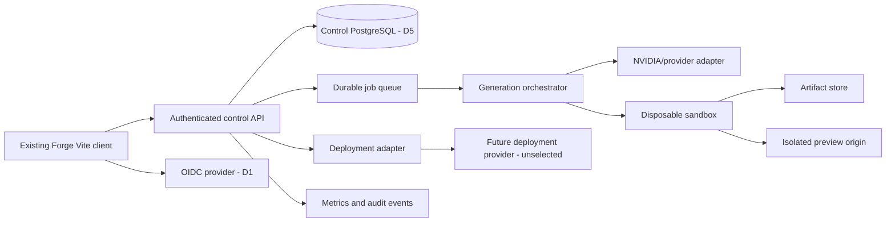

# Forge AI market-readiness plan

> Historical RFC/checkpoint document. The current application uses Next.js, Better Auth and `src/server` / `worker`. Old Vite/Neon Auth setup commands and pending architecture decisions below are historical context, not current setup instructions. See [PR #7 reconciliation](../reports/pr7-reconciliation.md).

## Scope and precedence (E0 review, 2026-09-09)

[RFC 0001](../rfcs/0001-app-generation-vertical-slice.md) is authoritative for the invited vertical slice. The first generated stack is **Next.js App Router + strict TypeScript + PostgreSQL**. Forge itself remains Vite with its existing escaped-rendering architecture; a React rewrite requires a separate owner decision and is not an E0/E1 dependency. Vendor names in the historical research and future market-release sections are candidates, not selected services or purchasing authority. Installed packages or concurrent prototypes do not close an RFC decision.

E0 implements offline contracts, deterministic safeguards and a control-schema migration. No generated-code execution, service purchase, infrastructure provisioning or public exposure is authorized by this milestone. See the [E0 review, checklist and E1 handoff](../reports/e0-contracts.md). The broader market-release goals below (three login methods, complete onboarding, production deployment) follow the RFC alpha; they do not expand its acceptance scope.

## Direction

Forge should move from a static pre-alpha demonstration to a production service through one deliberately narrow release path:

1. Retain the Vite + strict TypeScript Forge shell, semantic design tokens and five isolated presets. Evaluate a frontend rewrite separately if evidence warrants it; do not make it a prerequisite for engine work.
2. Use provider-neutral OIDC/session contracts and PostgreSQL control data with reviewed migrations and tenant isolation. Identity/hosting vendors remain RFC D1/D5; Neon and Drizzle research does not commit the implementation to them.
3. Generate Next.js App Router + strict TypeScript + PostgreSQL first. Other local brief stack choices record intent only and are unsupported by this generator until separately specified and tested.
4. Separate the control plane from untrusted generation and execution. The Forge API may schedule jobs and store metadata, but generated code must run in disposable, resource-limited sandboxes with denied-by-default network access.
5. Treat “100%” as a release gate, not a subjective progress label. A capability is complete only when its happy paths, failure paths, security controls, telemetry, documentation, and production rollback have been exercised.

This plan preserves Forge’s current product truthfulness while creating a path to a marketable service. It does not assume that adding an SDK or connecting a database makes the product production-ready.

## Current baseline

The repository is a polished local interface with browser-local project persistence, deterministic sample walkthroughs, five design systems, and an optional loopback NVIDIA text-planning endpoint. It has no user accounts, server project store, code-generation pipeline, execution sandbox, live generated preview, or deployment control plane.

At original plan drafting, lint, strict TypeScript, 33 tests, and the production build passed; this is historical evidence, not the current E0 test count. The live route from login preview to onboarding to new-project creation also works. One functional gap exists in the current onboarding state: `onboarded` is written to local storage but never used by the router, so the application neither enforces first-use onboarding nor skips it for returning users.

## Product scope for the first market release

### Included

- Google, GitHub, and verified email/password sign-up and sign-in.
- Password reset, email verification, logout, session management, account linking, account export, and account deletion.
- A versioned, restartable new-user onboarding flow.
- A guided new-project flow that produces a structured, editable brief.
- Durable user, workspace, project, version, message, job, artifact, usage, and audit data in PostgreSQL.
- Import of existing local Forge briefs into a signed-in account.
- Streaming AI planning with cancellation, usage accounting, typed errors, and resumable job state.
- Generated files for one supported application stack.
- Reviewable file diffs and version history.
- Isolated dependency installation, build, lint, typecheck, test, and preview execution.
- A live preview on a separate, untrusted origin.
- One production deployment adapter, recommended as Vercel for the first release.
- Quotas, abuse controls, observability, backup/restore drills, support procedures, and security release gates.

### Explicitly deferred

- General-purpose support for arbitrary languages, containers, or build commands.
- Automatic execution of arbitrary model-requested tools.
- Multiple production deployment platforms in the first release.
- Enterprise SSO, SCIM, advanced organization policy, and regulated-data claims.
- A promise that generated software is correct, secure, accessible, or license-clean without review.

## Onboarding research synthesis

The captured competitor review establishes three useful patterns:

| Product | Strong pattern | Weakness to avoid |
| --- | --- | --- |
| Bolt | Immediate prompt entry, visible execution history, build verification, and version cards | Capability density can overwhelm a first-time user; token rewards can turn onboarding into a form rather than product learning |
| Lovable | Mandatory visual-direction choice, result-oriented preview, suggested next actions, and selective editing | The visual choice can feel detached from the product brief if the rationale is not visible |
| Emergent | Requirements checkpoint for storage, visual style, and MVP scope; detailed agent/test timeline | Long autonomous timelines can obscure what is real, what changed, and what still needs approval |

Forge’s differentiator should be clarity before generation. The onboarding should not ask a disconnected demographic survey and then drop the user into an empty dashboard. Each answer should build a visible artifact: the Forge Brief.

## Proposed Forge onboarding: the Living Brief

### Journey A: account entry

1. The user lands on the existing scenic login composition.
2. Google, GitHub, and email controls are active and use the same calm visual hierarchy.
3. The page distinguishes “Create account” from “Sign in” without duplicating the entire form.
4. OAuth returns to a validated callback and restores the intended route.
5. Email registration requires verification before protected project data is created.
6. Existing accounts with the same verified email are linked only through an explicit, re-authenticated flow; silent linking is forbidden.
7. Authentication failures appear inline with a retry path and never expose provider or database internals.

### Journey B: first-use orientation

This journey is versioned and server-persisted. It contains four short stages and always shows progress, Back, Save and exit, and accessibility-compliant focus behavior.

#### Stage 1 — What are you here to make?

- Choices: start a product, prototype an idea, recreate/import an existing project, or explore a sample.
- Optional role and experience questions appear only when they change defaults; they are not required for product access.
- A short privacy statement explains what is stored and what will be sent to an AI provider.

#### Stage 2 — Shape the outcome

- Product name.
- Target user.
- Problem or desired outcome.
- Three to seven core capabilities.
- Constraints such as mobile support, accessibility, privacy, deadline, or existing stack.
- A visible brief preview updates as answers are entered.

#### Stage 3 — Choose the direction

- Present three recommended directions derived from the brief plus the full preset gallery.
- Each direction explains why it fits, which tokens and recipes it will use, and what it will not change.
- Light and dark previews remain independent from the Forge shell theme.
- The user can choose “decide later”; the system must never fabricate preference certainty.

#### Stage 4 — Review the build contract

- Show the normalized brief, supported stack, planned data needs, requested integrations, expected checks, and estimated usage before generation.
- Separate three actions: Save brief, Generate plan, and Generate application.
- Show exactly what each action sends externally and what it can change.
- Require explicit approval before the first code-generation job.

### Journey C: returning users

- A completed onboarding version routes directly to the project dashboard.
- A changed onboarding version shows a short “What’s new” checkpoint, not the entire flow again.
- Settings provides “Restart product tour” and “Create another guided project.”
- A QA-only new-user mode uses a fresh test identity and isolated database branch. It must not delete or overwrite a real user’s onboarding state.
- Deep links survive sign-in and onboarding when the user is authorized for the target resource.

### Onboarding acceptance criteria

- Every new account completes or explicitly skips all optional stages before reaching protected project routes.
- Returning accounts do not see first-use onboarding unless they choose to restart it or the required onboarding version changes.
- Refreshing, signing out, switching devices, or losing the network does not silently discard completed stages.
- Back/forward navigation, browser refresh, keyboard-only use, 200% zoom, reduced motion, screen-reader labels, and 390/768/1440px layouts are tested.
- Analytics capture stage viewed, completed, skipped, abandoned, resumed, and time-to-first-saved-brief without recording brief contents.
- The sample path remains available without falsely creating an authenticated user or a provider result.

## Application architecture

### Control plane

Add a separately configured authenticated TypeScript control service under `/api/v1/`. Preserve the existing loopback server and its Host/Origin, fixed-provider and secret-handling restrictions. It owns authorization, validation, idempotency, orchestration, usage limits, and durable state. It does not execute generated shell commands in its own process and never mounts a user’s broad filesystem.

Recommended internal boundaries:

- `auth`: session verification and authorization context.
- `db`: schema, migrations, repositories, transactions, and RLS tests.
- `projects`: briefs, versions, files, membership checks, and local-import reconciliation.
- `providers`: normalized model adapters and credential references.
- `jobs`: durable state machines, queues, cancellation, retries, and event streaming.
- `artifacts`: immutable generated snapshots, logs, test results, and checksums.
- `sandboxes`: runner lifecycle and policy; no provider SDK code.
- `previews`: signed routing, expiry, health state, and isolated origins.
- `deployments`: provider-specific adapters, approvals, status, rollback, and webhooks.
- `audit`: append-only security and product events with redaction.

### Client architecture

Keep `src/main.ts` as navigation/event coordinator and preserve escaped markup. Add typed engine request/state modules when E1/E2 are integrated. A React/router rewrite is a separate proposal requiring owner input, visual parity and migration evidence; it is not approved by this plan. Auth boundaries, conflicts, streaming and recovery still need explicit behavior and tests regardless of rendering framework.

## Authentication to 100%

### Foundation decision

RFC D1 must select and validate an OIDC issuer/library for invite-only platform authentication. Neon Auth was researched as one candidate; its SDK and schema must not become a dependency of E0. Three login methods and account-management flows below are later market-release goals, not replacements for the RFC platform-only login contract.

### Required configuration

- Separate isolated databases/environments for local development, automated tests, staging and production; hosting choice is D5.
- Distinct Google and GitHub OAuth applications for non-production and production.
- Exact callback URL and trusted-origin allowlists; no wildcard production callbacks.
- Custom SMTP provider and verified sending domain for verification, password reset, security notifications, and invitations.
- Branded but plain-text-capable email templates.
- Production cookie configuration: Secure, HttpOnly where applicable, SameSite appropriate to the OAuth flow, narrow path/domain, and rotation.
- A documented key and secret rotation procedure.
- Provider outage and degraded-email behavior.

### Required user flows

- Google sign-up/sign-in and callback cancellation.
- GitHub sign-up/sign-in and callback cancellation.
- Email registration, verification resend, expired verification, sign-in, password reset, expired reset, and password change.
- Account linking and unlinking with a safe last-login-method check.
- Session refresh, idle expiry, absolute expiry, logout current session, and logout all sessions.
- Re-authentication for account deletion, email change, provider unlinking, and sensitive deployment actions.
- User export and deletion, including a documented retention window for logs and billing records.
- Suspended/deleted user handling and provider-account revocation.

### Authorization requirements

- Authentication answers “who”; workspace membership and roles answer “what may they do.”
- Every API route checks the authenticated principal and membership; client route guards are only user experience.
- Database RLS provides defense in depth for every tenant-owned table.
- Background jobs receive a narrow, immutable authorization snapshot and re-check authorization before destructive or billable transitions.
- Service roles are limited by function. The application must not query through a database owner role that bypasses RLS.

### Auth test matrix

- Unit tests for auth-state reducers, intended-route validation, and error mapping.
- Integration tests against the selected identity adapter and isolated PostgreSQL for sessions, expiry, revocation, account linking and RLS.
- End-to-end tests for all three login methods in staging.
- Negative tests for CSRF/state mismatch, callback manipulation, open redirects, session fixation, cookie theft assumptions, brute force, user enumeration, cross-user access, and stale membership.
- Recovery drill for an OAuth secret rotation and SMTP outage.

## PostgreSQL database to 100%

### Recommended data model

RFC §4 and `engine/migrations/0001_control.sql` define the vertical-slice control schema in `forge_control`. It does not depend on an identity-vendor schema or an ORM. The following broader market model is conceptual future work; do not create duplicate jobs/events/membership tables alongside the RFC schema. ORM adoption remains an implementation choice only if it preserves the reviewed SQL and constraints.

| Table | Purpose | Critical constraints/indexes |
| --- | --- | --- |
| `profiles` | Forge-specific user preferences and onboarding state | PK/FK user ID; onboarding version/status; timestamps |
| `workspaces` | Personal or team ownership boundary | stable ID, slug uniqueness, soft-delete state |
| `workspace_memberships` | user/workspace role mapping | unique workspace/user; role enum; membership indexes |
| `projects` | current project identity and summary | workspace FK; status; updated index; soft-delete state |
| `project_versions` | immutable brief/configuration snapshots | project/version uniqueness; author; content checksum |
| `project_files` | current logical file tree or immutable version references | normalized path uniqueness; size and hash constraints |
| `conversations` | project conversation threads | workspace/project ownership and ordering |
| `messages` | user, assistant, system, and tool-result records | bounded content; provider metadata separated from display content |
| `generation_jobs` | durable job state machine | idempotency key; status/created indexes; lease and retry fields |
| `generation_events` | ordered progress and audit-safe job output | job/sequence uniqueness; bounded payload |
| `artifacts` | immutable build, test, preview, and export objects | checksum; content type; size; storage key; retention state |
| `preview_deployments` | ephemeral preview lifecycle | project/job relation; expiry; provider ID; state |
| `production_deployments` | approved deployments and rollback chain | environment; provider ID; commit/artifact checksum |
| `provider_connections` | metadata and secret-manager references | never store raw provider secrets in ordinary columns |
| `usage_ledger` | append-only token, sandbox, storage, and deployment usage | workspace/time indexes; immutable source event |
| `audit_events` | security-relevant actor/action/resource records | append-only; actor/workspace/time indexes; redacted metadata |
| `idempotency_keys` | replay protection for mutations and billable actions | scoped unique key; request hash; expiry |

### Migration discipline

- Use append-only reviewed SQL migrations; any migration generator must preserve them. Never use schema push against production.
- Apply every migration to an isolated PostgreSQL database in CI; native database evidence is distinct from embedded test evidence.
- Run forward migration, compatibility tests, representative query plans, and rollback/recovery rehearsal before production.
- Use expand/migrate/contract for breaking changes so old and new application versions overlap safely.
- Record schema version and migration checksum.
- Seed only synthetic data outside production.
- Keep a tested point-in-time restore and snapshot procedure; a backup feature is not complete until a restore drill succeeds.

### RLS and query requirements

- Enable RLS on every workspace-owned table before granting application access.
- Policies derive ownership from the authenticated user and membership, covering SELECT, INSERT, UPDATE, and DELETE separately.
- Add tests proving one user cannot enumerate, infer, mutate, or attach artifacts to another workspace.
- Use parameterized queries and explicit column lists.
- Add pagination and stable ordering to every list endpoint.
- Set query timeouts, transaction boundaries, and maximum result sizes.
- Capture slow queries and verify indexes with realistic data volume.

### Local-data migration

- On first authenticated session, detect valid `forge.workspace.v1` records.
- Preview exactly which briefs will be imported and which account/workspace will own them.
- Use an idempotent import mutation keyed by the local project ID and content hash.
- Preserve local data until server acknowledgement and user confirmation.
- Resolve name conflicts explicitly; never overwrite server projects silently.
- Retain JSON export and add server-side export.

## Project workspace to 100%

The current CRUD experience is a strong prototype. Production completion requires:

- Server-authoritative create, read, update, archive/delete, restore, duplicate, rename, search, and pagination.
- Optimistic UI with rollback and conflict feedback.
- Autosaved drafts with debouncing, revision preconditions, and conflict resolution across tabs/devices.
- Immutable version snapshots and user-visible history.
- Import/export with schema versions and validation.
- Empty, loading, offline, permission-denied, rate-limited, storage-full, and service-unavailable states.
- Workspace membership and role-aware controls.
- Accessible dialogs, notifications, tabs, keyboard navigation, responsive layout, zoom, reduced motion, and screen-reader testing.
- Project lifecycle states: draft, planning, generating, ready, failed, archived, and deleted.
- Data-retention and deletion semantics for projects, artifacts, previews, deployments, logs, and backups.

## AI planning to 100%

The existing NVIDIA endpoint proves only a synchronous text path. Production planning needs:

- A provider-neutral adapter contract with model discovery, credential validation, streaming, cancellation, usage, tool-request data, typed errors, retryability, and health.
- Server-sent event streaming from provider to a durable job/event stream.
- A job state machine such as queued → planning → awaiting approval → generating → validating → ready/failed/cancelled.
- Durable partial output and reconnect/resume behavior.
- Versioned system prompts, model configuration, temperatures, tool schemas, and output schemas.
- Structured planning output validated against a schema before it can schedule generation.
- Per-user and per-workspace concurrency, token, request, cost, and daily limits.
- Backoff, timeouts, circuit breaking, provider failover policy, and clear retry semantics.
- Prompt/content size limits, secret detection/redaction, and an explicit statement of what is sent to the provider.
- Offline evaluation sets for plan completeness, unsupported claims, unsafe commands, path traversal attempts, and prompt injection.
- Production telemetry for latency, time to first token, completion reason, provider errors, cancellation, token usage, and estimated cost—without logging sensitive prompts by default.

NVIDIA’s current NIM API supports model listing, streaming, tool calling, response cancellation, health probes, and metrics. Forge should consume those capabilities behind its own adapter rather than exposing provider-specific behavior throughout the product.

## Code generation to 100%

### Generation contract

The first supported generator should accept a versioned structured specification and emit a bounded patch set, not unrestricted prose. RFC 0001 permits only create, replace and delete with validated project-relative paths. Rename is delete plus create; arbitrary patch/shell/archive operations are deferred.

Required controls:

- Reject absolute paths, traversal segments, symlink escapes, device files, oversized files, binary files outside an allowlist, and archive bombs.
- Limit file count, total bytes, command count, runtime, processes, memory, CPU, and output volume.
- Keep model-proposed commands as data until a policy layer approves them.
- Use curated base templates and pinned toolchains rather than allowing arbitrary bootstrap commands.
- Generate and preserve lockfiles.
- Show a diff before applying a new version.
- Make every generation reversible through immutable project versions.
- Separate generated source, build output, logs, and deployment artifacts.
- Scan generated files for secrets, malicious scripts, vulnerable dependencies, and disallowed licenses.

### Validation pipeline

For the first supported stack, every candidate version runs:

1. File-contract and schema validation.
2. Dependency-policy validation and locked installation.
3. Formatting and linting.
4. Strict TypeScript checking.
5. Unit/component tests.
6. Production build.
7. HTTP smoke tests.
8. Browser flow checks for the requested acceptance criteria.
9. Accessibility smoke checks.
10. Secret, dependency, and artifact scanning.

The UI must distinguish model claims from executed evidence. A check is green only when the runner produced a signed result for the exact artifact checksum being previewed.

## Sandbox execution and preview to 100%

### Isolation decision

RFC D2 proposes hardened Linux Firecracker microVMs subject to feasibility and isolation evidence. Managed services (including E2B) and alternative runtimes are unselected candidates requiring an explicit RFC amendment and the same measured controls. Ordinary Docker containers cannot satisfy the hostile multi-tenant isolation gate. E0 uses a non-executing runner fake only.

Each job requires:

- A fresh sandbox identity and filesystem.
- No host filesystem, Docker socket, cloud metadata endpoint, or broad credential mounts.
- Non-root execution and a read-only base image.
- Job-specific writable workspace and artifact upload credentials.
- CPU, memory, disk, process, file, output, and wall-clock quotas.
- Zero internet egress for generated builds; materialize a verified offline dependency cache. Any future registry/network exception requires a separate policy review.
- No inbound route except the authenticated preview proxy.
- Forced expiry and cleanup, including on worker failure.
- Redacted, bounded logs and append-only lifecycle events.
- Regular escape, cross-tenant, SSRF, DNS rebinding, resource-exhaustion, and persistence tests.

Managed E2B states that each sandbox receives its own Firecracker microVM and does not share kernel, filesystem, or memory with other sandboxes. gVisor offers an OCI-compatible application-kernel boundary but still requires external cgroup and network policy controls. A production decision must include measured compatibility, latency, cost, region, data-retention, incident-response, and vendor-exit evidence.

### Preview architecture

- Serve previews from a separate registrable domain so generated code cannot access Forge cookies or origin storage.
- Use unguessable, short-lived preview tokens or authenticated proxy sessions.
- Apply restrictive CSP, permissions policy, frame policy, and outbound connect policy.
- Disable preview access to control-plane APIs except a deliberately narrow bridge.
- Display artifact checksum, build time, expiry, and test status.
- Support desktop/mobile viewport controls, reload, console/log view, and deterministic restart.
- Stop or suspend idle previews and enforce workspace concurrency limits.
- Never present a screenshot as a live preview or a fixture check as an executed result.

## Deployment to 100%

### Future adapter decision (outside RFC 0001)

Vercel was researched as a candidate for a future production deployment adapter. No deployment vendor is selected and RFC 0001 deliberately has no public deployment service. Revisit the provider-neutral adapter and vendor decision in a later deployment RFC.

Required flow:

1. User explicitly connects a deployment account with the minimum required scopes.
2. Forge validates the exact artifact, checks, target project, environment, and environment-variable names.
3. A preview deployment is created first.
4. Forge receives signed webhook updates and reconciles by polling after missed events.
5. The user reviews the preview and explicitly promotes the same artifact checksum to production.
6. Forge records provider deployment IDs, URLs, status, actor, artifact checksum, and timestamps.
7. Rollback redeploys a known-good immutable artifact; it does not regenerate code.

### Deployment safeguards

- Separate preview and production credentials and environment variables.
- Never expose secret values to the browser, model, build logs, or generated source.
- Require re-authentication for first production connection, secret changes, custom-domain changes, and production promotion.
- Idempotent creation and webhook handling.
- Rate limits and spend controls.
- Domain ownership validation and safe redirect handling.
- Failed, cancelled, superseded, rolled-back, and provider-outage states.
- End-to-end staging tests and a documented provider exit/export path.

## Security and abuse release program

The security target should map to NIST SSDF and OWASP ASVS, with AI-specific abuse cases added. At minimum:

- Threat model and data-flow review for auth, database, model provider, runner, artifact store, preview, deployment, email, and analytics.
- Secret manager, automated rotation, log redaction, and secret scanning.
- Dependency review, lockfiles, SBOM, artifact provenance, and vulnerability response process.
- SAST, dependency scanning, container/image scanning, and targeted DAST in CI.
- Rate limiting by IP, user, workspace, endpoint, provider, and job type.
- Abuse controls for account farming, cryptomining, malware generation, phishing, spam, credential theft, denial of wallet, and prohibited content.
- Human approval before durable file application and production deployment.
- Prompt-injection tests proving model output cannot expand its own tools, permissions, egress, or credentials.
- Incident response, user notification criteria, backup/restore, disaster recovery, and provider outage runbooks.
- Independent penetration test before general availability and remediation verification for high-risk findings.
- Public security policy, vulnerability disclosure channel, privacy policy, terms, subprocessors, retention schedule, and deletion/export process.

OWASP identifies excessive agency as a central risk when model-selected tools have excess functionality, permission, or autonomy. Forge must therefore keep the model outside the authorization boundary: the model proposes; deterministic policy and explicit user approvals authorize.

## Reliability, operations, and commercial readiness

### Observability

- Structured logs with request, user-safe correlation, workspace, project, job, and deployment IDs.
- Metrics for auth success/failure, API latency/error rate, database saturation and slow queries, queue depth/age, provider latency/errors, sandbox startup/runtime/failures, preview availability, deployments, cost, and quota rejection.
- Distributed traces across API, queue, provider, sandbox, artifact, and deployment operations.
- Alert thresholds tied to runbooks and ownership.
- Synthetic checks for sign-in, project creation, planning, generation, preview, and deployment in staging and production-safe canaries.

### Service management

- Stated availability and support expectations that match measured capability.
- Status page and incident communications.
- Feature flags and kill switches for provider, generation, preview, and deployment.
- Canary releases, database-compatible rollback, and production rollback drills.
- Capacity tests and cost models for token, sandbox minute, artifact storage, egress, database, preview, and deployment usage.
- Billing ledger reconciliation before introducing paid plans.
- Customer support tooling that does not expose prompts, source, or secrets by default.

### Product analytics

Measure activation without collecting project content:

- Sign-up started/completed by method.
- Verification and OAuth callback failure rate.
- Onboarding stage completion and abandonment.
- Time to first saved brief, first plan, first successful generation, first live preview, and first deployment.
- Generation retry/cancel/failure causes.
- Preview-to-deploy conversion and rollback rate.
- Retention cohorts based on safe event metadata.

## Delivery sequence

The estimates assume a focused team of four to six experienced engineers plus part-time product design, security, and QA. They are planning ranges, not commitments.

| Phase | Outcome | Expected duration | Exit gate |
| --- | --- | ---: | --- |
| 0. Decisions and foundations | RFC decisions, E0 contracts, environment model, threat model, CI checks | 1–2 weeks | Approved architecture and measured auth/database spike |
| 1. Application shell | Typed engine integration into existing shell with visual parity | 2–3 weeks | Existing flows and visual matrix pass with no capability regression |
| 2. Auth and PostgreSQL | Three login methods, RLS schema, migrations, protected API | 3–5 weeks | Full auth/RLS E2E matrix passes in isolated branches |
| 3. Living Brief and projects | Versioned onboarding, guided project creation, server CRUD, local import | 3–4 weeks | New and returning journeys pass across devices and failure states |
| 4. Production planner | Durable jobs, streaming NVIDIA adapter, quotas, evals | 2–4 weeks | Real plans stream, resume, cancel, meter, and fail safely |
| 5. One-stack generator | Structured patches, versions, files, validation | 4–7 weeks | Golden prompts generate reproducible buildable artifacts |
| 6. Sandbox and preview | Isolated runner, scans, live preview, evidence | 4–7 weeks | Adversarial isolation suite and preview SLO pass |
| 7. Deployment | Selected deployment adapter, preview, promotion, status, rollback | 3–5 weeks | Same tested artifact deploys and rolls back end to end |
| 8. Beta hardening | load/cost tests, pen test, recovery, support/legal/ops | 4–6 weeks | All launch gates signed off; no open critical/high risks |

With parallel work after the foundations, a credible private beta is approximately 14–20 weeks and a narrowly scoped general-availability release approximately 22–32 weeks. A solo implementation should be expected to take substantially longer. Adding all three current stack choices and multiple deployment providers before launch would extend the schedule and risk surface materially.

## Progress model

Progress should be reported by passed evidence, weighted by product risk:

| Workstream | Weight | Evidence required for 100% |
| --- | ---: | --- |
| Identity and onboarding | 15% | all auth/onboarding journeys, recovery, accessibility, telemetry, and security tests pass |
| Durable data and authorization | 15% | migrations, RLS isolation, import, backup and restore drill pass |
| Project workspace | 10% | complete server CRUD, sync/conflicts, history, export, and failure states pass |
| AI planning/orchestration | 10% | streaming, durable jobs, cancellation, limits, evals, and provider failure behavior pass |
| Code generation | 15% | structured one-stack generation meets the golden evaluation and validation suite |
| Sandbox and preview | 15% | isolation, resource, egress, preview, and adversarial gates pass |
| Deployment | 10% | connect, preview, promote, observe, fail, and rollback pass |
| Security/reliability/operations | 10% | pen test, incident/restore/rollback drills, observability, support, and legal gates pass |

Earlier 25–30% estimates were qualitative and are retired as acceptance evidence. Use the RFC stage checklist and linked test results; no new completion percentage is inferred from E0. UI presence alone does not earn completion for a backend or security capability.

## Immediate implementation backlog

### Decisions and first engineering slice

The first stack is settled: Next.js App Router + strict TypeScript + PostgreSQL. RFC D1–D8 identify owner decisions at their actual integration/release gates; they do not block vendor-independent E0 or E1 work against explicit fakes. A Forge frontend rewrite and a future deployment vendor are separate owner proposals, outside the alpha scope.

Follow RFC E0 → E1 rather than beginning with a Neon spike or frontend migration. E0 delivers versioned runtime contracts, approval/hash/path validation, deterministic state transitions and reviewed control SQL. E1 builds the durable service, session/tenant authorization, project CRUD, atomic admission/reservations, queue leases/fencing, idempotency and SSE replay with provider/runner fakes. Connect an identity vendor or hosted database only after D1/D4/D5 closure and the applicable authorization. Preserve local briefs, fixture labels and the loopback prototype.

The [E0 report](../reports/e0-contracts.md) records exact files, current verification evidence, remaining decisions and E1 assignment. Market-release onboarding and production deployment work remains on this broader backlog; it must not be represented as implemented alpha capability.

## Launch checklist

Forge is market-ready only when all answers below are “yes” with linked evidence:

- Can a new user register through Google, GitHub, and verified email and recover every supported failure?
- Can a returning user resume on another device without repeating onboarding?
- Can two users and two workspaces prove tenant isolation at API and database layers?
- Can local briefs import without loss or silent overwrite?
- Can a plan stream, cancel, reconnect, meter, and recover from provider failure?
- Can the supported stack generate a reviewable diff and pass executed—not claimed—checks?
- Can hostile generated code be contained under tested filesystem, process, resource, and network policies?
- Is every live preview isolated from Forge sessions and control-plane data?
- Can the exact reviewed artifact deploy to preview and production, then roll back?
- Can operators detect, stop, investigate, restore, and communicate a failure?
- Have backup restore, database migration rollback, OAuth secret rotation, provider outage, runner compromise, and deployment rollback been rehearsed?
- Have privacy, terms, retention, subprocessors, support, abuse handling, and vulnerability disclosure been published?
- Has an independent security review found no unresolved critical or high-risk launch blocker?

## Sources

1. Forge AI. “Builder UX evidence: Pomodoro timer.” Local research record, `research/evidence/README.md`, September 9, 2026.
2. Neon. “[Neon Auth: branchable identity in your database](https://neon.com/docs/changelog/2025-12-12).” December 12, 2025.
3. Neon. “[Meet the New Neon Auth: Branchable Identity in Your Database](https://neon.com/blog/neon-auth-branchable-identity-in-your-database).” December 10, 2025.
4. Neon. “[Row-Level Security with Neon](https://neon.com/docs/guides/row-level-security).” Updated July 31, 2025.
5. Neon. “[Neon serverless driver](https://neon.com/docs/serverless/serverless-driver).” Updated October 10, 2025.
6. Neon. “[Neon MCP Server overview](https://neon.com/docs/ai/neon-mcp-server).” Accessed September 9, 2026.
7. Neon. “[Backup & Restore and snapshots](https://neon.com/docs/changelog/2025-10-31).” October 31, 2025.
8. Neon. “[Auth that works in Vercel previews](https://neon.com/blog/auth-that-just-works-in-vercel-previews).” January 19, 2026.
9. NVIDIA. “[NIM for Large Language Models API Reference](https://docs.nvidia.com/nim/large-language-models/latest/api-reference.html).” Updated September 2026.
10. NVIDIA. “[NIM LLM Architecture](https://docs.nvidia.com/nim/large-language-models/latest/reference/architecture.html).” Updated September 2026.
11. E2B. “[Security and compliance](https://e2b.dev/security).” Accessed September 9, 2026.
12. gVisor. “[Security Model](https://gvisor.dev/docs/architecture_guide/security/).” Accessed September 9, 2026.
13. Vercel. “[Deploying to Vercel](https://vercel.com/docs/deployments/overview).” Accessed September 9, 2026.
14. NIST. “[Secure Software Development Framework Version 1.1](https://csrc.nist.gov/pubs/sp/800/218/final).” February 2022.
15. OWASP. “[Application Security Verification Standard](https://devguide.owasp.org/en/11-security-gap-analysis/01-guides/02-asvs/).” Accessed September 9, 2026.
16. OWASP GenAI Security Project. “[LLM06:2025 Excessive Agency](https://owasp.org/www-project-top-10-for-large-language-model-applications/2_0_vulns/LLM06_ExcessiveAgency.html).” Accessed September 9, 2026.
