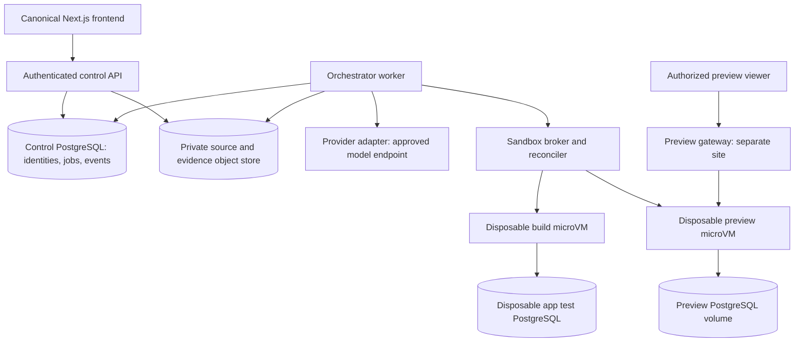
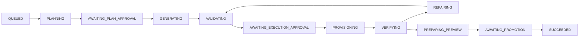

# RFC 0001: First executable app-generation slice

Status: **E0 contracts and vendor-independent E1 fixture control implemented; live integration/release gates remain open**  
Date: 2026-09-09  
Scope: private alpha, one generated stack: Next.js App Router + strict TypeScript + PostgreSQL  
Decision owner: Forge maintainer  
Implementation gate: E0 review is recorded in [the E0 report](../reports/e0-contracts.md); E1 implementation and its fixture-only evidence are recorded in [the E1 report](../reports/e1-control.md). Resolve §16 decisions at the named integration stages; no vendor or frontend rewrite is implicitly approved.

## 0. Demo-delivery amendment — 2026-09-10 UTC

This amendment supersedes conflicting scope/vendor/frontend statements in the historical E0–E5 reports and the original observations below. It records the user's direction, not successful acceptance. Task 01 owns the [canonical composition and contracts](../operations/demo-delivery-coordination.md); the [baseline report](../reports/demo-delivery/task-01-baseline.md) records reproduction evidence.

- **Included:** open-source BYOK, using explicit tested provider adapters. Self-hosted keys use server environment/secret references. Hosted credential connections require authenticated TLS submission, tenant authorization, encryption at rest, rotation/deletion and redacted read status. Keys never enter localStorage, public environment variables, model context, generated source, exports, previews or telemetry. Administrator-approved destinations and DNS/IP/redirect controls are required; arbitrary provider compatibility is not promised. No key or configured adapter authorizes spending.
- **Selected:** Vercel hosts the Forge frontend and the real generated portfolio demonstration. Use default platform HTTPS URLs; **no domain purchase**. Task 08 owns deployment writes and verifies the actual public URL and source/deployment hashes. No new subscription, infrastructure purchase or billable model run is authorized without an applicable explicit budget.
- **Included acceptance:** an authenticated owner generates and reviews actual portfolio source through the engine, verifies it using the approved runtime, and publishes the reviewed artifact. The public portfolio is viewable without a Forge account. A hand-authored scaffold or fixture is supporting evidence only. Portfolio requirements may omit an application database; the engine still requires **Next.js App Router + strict TypeScript + PostgreSQL**, including the task-board CRUD/restart and additive priority migration acceptance.
- **Canonical frontend:** preserve the Next.js application already merged in PR #4, its design and source/data workflow. Preserve the E0/E1/E2 source contracts and broker implementation in the same repository. The RFC engine remains a separately configured, default-off laboratory until Tasks 02–07 supply real adapters and Task 01 integrates them. Existing local Docker execution does not close the RFC microVM isolation gate. No automatic mapping of application accounts/jobs to fixture accounts/jobs is allowed.
- **Separate unresolved infrastructure:** public website hosting does not select sandbox execution, durable worker hosting/workflow service, control PostgreSQL configuration, versioned object storage/KMS/backups, private preview authorization/routing, or public multi-user generation. A Vercel Function is not an assumed durable worker or sandbox. Vercel Sandbox is a separately evaluated option requiring a documented contract amendment, access and cost feasibility. Keep missing runtime/worker/storage configuration unavailable.
- **Private preview:** no purchase is permitted to satisfy D6. Task 07 must prove a default-hostname or other no-purchase arrangement's site/origin/cookie, TLS, ticket/revocation and exact environment boundaries. The separate-site invariant remains until equivalent evidence supports an amendment. Public portfolio deployment is distinct from private previews; publishing it grants no anonymous control, generation, key or private-preview access. Public multi-user generation is not required for the owner demonstration and remains unapproved.

Better Auth and Neon are existing application choices documented by the reconciled working agreement; reuse that work rather than creating another account authority. Their existence does not prove RFC identity/membership mapping, deployed database authorization or restore acceptance. D1/D5 integration gates remain open. All D1–D8 live acceptance gates remain open even where a scope direction is selected. See the coordination decision table for each distinction.

Official hosting references checked 2026-09-10 UTC: [generated deployment URLs](https://vercel.com/docs/deployments/generated-urls) are available without a purchased custom domain and may be public; [Functions limits](https://vercel.com/docs/functions/limitations) constrain request execution; [Sandbox](https://vercel.com/docs/sandbox) is a separate execution service. These documents are product capability references, not account entitlement or containment evidence.

### 0.1 Release/self-host follow-up — 2026-09-10 UTC

The new user-started release brief extends public publishing beyond the portfolio-only demonstration: **Forge itself must be publicly hosted on Vercel with a truthful recorded app-building flow, and generated applications must have a separate authenticated in-product Publish flow and public URLs.** Neither a portfolio nor the current availability page substitutes for the connected Forge product. This records required scope, not implementation or acceptance; the [release coordination board](../operations/forge-release-coordination.md) records the starting baseline and the absence of a final staged release.

Self-hosting and hosted BYOK are both included. Credit sales, subscriptions, payment checkout and a Forge model-billing product are not required; bounded usage, abuse limits and retention of uncertain provider charges remain required. Provider credentials and hosting credentials are separate authorities. No new service purchase, billable test, custom domain or public multi-user generation is authorized by this direction.

Public Publish must bind the owner's authorized, reviewed generated source and verified artifact to its actual deployment and public URL, with publishing/rollback evidence. It is distinct from private preview authorization and does not grant anonymous generation, key access or control authority. Exact supported publication profiles, app-database/durable hosting, hosting credential integration and lifecycle/rollback contracts remain unresolved implementation choices for review. Preserve the Next.js + strict TypeScript + PostgreSQL generated-stack requirement and existing containment, identity, storage and acceptance gates; do not execute generated code on a developer/control host to make a demonstration pass.

The new release brief assigns shared Forge UI integration to a Task04 role; its actual session must be identified before assigning edits. Historical task numbers do not automatically reassign existing workers. Task01 remains the shared contracts/migrations/integration owner. New Task09 can complete independent docs/audits at its pinned baseline, but final release verification must use Task01's later exact staged commit containing the required production dependencies.

## 1. Outcome and current evidence

A signed-in, invited user can create a server project, submit a brief, review a plan, review generated changes and commands, approve execution, and use a private running application backed by PostgreSQL. They can request one subsequent change through the same workflow, inspect actual verification results, promote a passing source snapshot, restore a previous source version, and download a source archive. Every run has durable status, cancellation, bounded spending, and cleanup.

This RFC defines a limited, testable release. Passing it does not establish complete competitor parity, production hosting, or capacity for thousands or billions of simultaneous builders. Earlier percentage estimates were qualitative assessments; they are not a measured backlog or an acceptance criterion.

Historical repository observations at RFC drafting (the canonical composition above supersedes obsolete frontend statements):

| Source | Observed boundary and consequence |
| --- | --- |
| [AGENTS.md](../../AGENTS.md) | Preserve escaped rendering, local demo behavior, loopback provider boundary, and repository checks. |
| [README.md](../../README.md), [architecture](../architecture.md) | Vite remains the Forge frontend. Next.js is generated output; this proposal does not migrate Forge to Next.js. |
| [security model](../security-model.md) | Untrusted code requires a separate disposable runner, scoped resources, explicit execution review, and abuse-case tests. |
| [provider integration](../provider-integration.md), [NVIDIA prototype](../nvidia-provider.md) | Existing provider returns text, without streaming or tool execution. Previous smoke tests establish only individual planning success. |
| [competitor observations](../../research/evidence/README.md) | Use real progress, file inspection, preview, version history, and test evidence as workflow references. Captures do not establish competitors' internal architecture or reliability. |
| `server/app.mjs`, `server/provider.mjs` | One in-flight request, in-memory accounting, fixed provider destination, loopback admission controls. None supplies a public multi-user job service. |
| `src/storage.ts`, `src/main.ts`, `src/demo.ts` | Local briefs are versioned; generated plans live in a browser-memory map; sample files/checks are fixtures. No server ownership or source history exists. |

The research directory was untracked at drafting time. Preserve its contents; a future review package must include the evidence or retain this observation summary if those files are not published. Use screenshots to understand interaction patterns, not to copy competitor branding or infer backend behavior.

## 2. Scope and concrete reference application

The acceptance application is a **task board**: create, list, edit, complete, and delete tasks, with title validation and status filtering. Next.js Route Handlers use parameterized PostgreSQL queries. Creating a task, restarting the app process, and reading the same row proves server persistence. A follow-up request adds a priority field using an additive migration and updates the UI. The captured Pomodoro brief is a second visual/interaction benchmark, extended with PostgreSQL session history to exercise this stack.

Included: platform login and project authorization; durable jobs; one versioned template; plan and patch review; real generation; immutable source artifacts; isolated build/test execution; private expiring preview; source promotion/restoration; clean source export; one additive database migration; usage reservation; operator diagnostics.

Included by §0–0.1: BYOK, connected public Forge on Vercel, authenticated in-product generated-app Publish and the genuine portfolio demonstration. Publication profile and app-database hosting/lifecycle decisions remain unresolved; general production deployment beyond a reviewed profile, custom domains, GitHub integration/import, arbitrary repository/archive uploads, arbitrary packages or shell commands, other stacks, external connectors, generated user authentication, real payments/email, collaboration editing, mobile generation and automatic image generation remain deferred. Unpublished generated apps remain private test apps protected by Forge's preview gateway. Public publication requires its separate reviewed artifact/authority; the private gateway is not generated application authentication. This slice must not process production or sensitive customer data.

Uploaded image understanding is also deferred. Existing Forge preset assets may be selected by an immutable asset ID with provenance. A later attachment service needs size/type validation, isolation for decoders, retention controls, and an explicit provider data-transfer policy. No model-side fetching of arbitrary screenshot URLs in this slice.

## 3. Architecture and service boundaries

Use a modular TypeScript backend with separate process identities where trust or workload differs. Start in one region. PostgreSQL supplies the durable queue and event log; no Redis, Kafka, Temporal, or Kubernetes dependency is required for this slice. Future replacement must preserve the contracts below. Keep workflow execution out of HTTP request lifetimes.



| Component | Responsibilities | Allowed authority |
| --- | --- | --- |
| Control API | Session checks, tenant authorization, validation, job admission, approvals, SSE, artifact reads, preview launch tickets | Control DB and scoped artifact access; cannot spawn processes or administer runner hosts |
| Orchestrator | Durable stage transitions, provider calls, budget enforcement, manifest validation, review preparation, check scheduling | Worker DB role, job-scoped artifacts, server secret reference, authenticated broker RPC; no arbitrary host shell |
| Provider adapter | Normalize text/structured responses, usage, errors, cancellation | One configured HTTPS provider; no runner, project DB, or command execution |
| Sandbox broker | Allocate resource leases, verify signed descriptors, launch/stop environments, collect bounded artifacts | Dedicated runner management identity; no platform user sessions or provider keys |
| Sandbox host | Enforce isolation, network policy, resource caps, watchdog deadlines | Dedicated patched Linux hosts in separate network; no control database route or broad cloud IAM |
| Guest runtime | Execute approved candidate, migration, build, and tests | Only candidate filesystem and its own app DB; considered hostile even after tests pass |
| Preview gateway | Authenticate viewers and route an exact preview generation to a healthy guest | Read-only preview authorization service; never accepts caller-specified upstream URLs |
| Reconciler | Recover expired leases, clean orphan environments/artifacts, enforce deadlines and quota reconciliation | Narrow service identities; cleanup operations are idempotent |

Implementation layout: E0 now uses `engine/contracts/`, `engine/workflows/`, `engine/testing/`, `engine/migrations/` and `tests/engine/`. Remaining proposed layout: `engine/contracts/`, `engine/control/`, `engine/workflows/`, `engine/providers/`, `engine/artifacts/`, `engine/runner-client/`, `engine/migrations/`, `runner/`, `templates/next-postgres-v1/`, and `tests/engine/`. The remaining integration directories are proposals, not live services. Keep `server/` and `/api/provider`, `/api/generate` as the existing loopback planning prototype. Introduce `/api/v1/` behind a separately configured authenticated service; never relax the existing Host/Origin checks to expose the prototype.

Next.js self-hosting supports a Node server; place the private gateway/reverse proxy in front of it. Pin the tested Next.js/Node versions at template release and run the built server, rather than exposing development mode. See [Next.js self-hosting](https://nextjs.org/docs/app/guides/self-hosting). All versions and image digests must be recorded in the template manifest; do not use `latest` when creating jobs.

## 4. Platform identity and control database schema

Use OIDC authorization-code login with PKCE and a server-side session. The identity vendor remains D1 in §16. Validate issuer, audience, signature, nonce, and state through a maintained OIDC library. Invite-only access is checked before provisioning a workspace. Sessions use opaque rotated IDs, server-side revocation, a 12-hour absolute lifetime, and a Secure, HttpOnly, host-only cookie. CSRF tokens and exact Origin validation protect state-changing requests. No secrets or bearer tokens enter localStorage.

The alpha grants project access through workspace membership. Roles: `owner` manages workspace access/deletion; `editor` creates projects, reviews, executes, cancels, promotes and exports; `viewer` reads files/events and opens authorized previews. All sensitive reads and writes check current membership. Return 404 for resources outside the authorized tenant; 403 for a known resource with insufficient role. Revocation terminates SSE and preview sessions within the target in §14.

Schema notation: all IDs are server-generated UUIDs; time columns are `timestamptz`; hashes are lowercase SHA-256 hex; monetary values are integer USD microdollars (`bigint`), never floating point. V1 wire integers are bounded to JavaScript safe integers (0–9,007,199,254,740,991); ledger adjustments may be signed within that range. Reject larger values rather than round them. Tables have `created_at` unless stated. `?` means nullable. JSON columns have a versioned runtime schema and byte caps. Schema migrations are append-only and reviewed.

| Table | Required columns beyond `created_at` | Keys, constraints, and indexes |
| --- | --- | --- |
| `users` | `id`, `oidc_issuer`, `oidc_subject`, `disabled_at?` | PK `id`; unique issuer + subject; email is not identity |
| `workspaces` | `id`, `name`, `disabled_at?`, `deleting_at?` | PK `id` |
| `memberships` | `workspace_id`, `user_id`, `role` | PK workspace + user; FK user/workspace; role enum check |
| `sessions` | `id_hash`, `user_id`, `expires_at`, `revoked_at?`, `csrf_hash` | PK hash; FK user; expiry index; store no raw session token |
| `projects` | `id`, `workspace_id`, `name`, `brief`, `preset_id`, `preset_version`, `template_id`, `template_digest`, `head_snapshot_id?`, `revision`, `deleting_at?` | PK id; unique workspace + id; name 1–100, brief 20–12,000 characters; revision starts at 1 |
| `jobs` | `id`, `workspace_id`, `project_id`, `created_by`, `kind`, `base_snapshot_id?`, `base_revision`, `request_json`, `state`, `state_version`, `policy_digest`, `template_digest`, `prompt_version`, `model_policy_json`, `plan_artifact_id?`, `candidate_snapshot_id?`, `repair_count`, `cost_limit_micros`, `active_remaining_ms`, `active_started_at?`, `active_deadline_at?`, `review_expires_at?`, `review_digest?`, `review_json?`, `cancel_requested_at?`, `error_code?`, `next_event_seq`, `finished_at?` | PK id; unique workspace + project + id; kind `generate` or `restore`; nonnegative budget and repairs; partial unique workspace + project where finished_at IS NULL |
| `job_steps` | `id`, `workspace_id`, `project_id`, `job_id`, `stage`, `attempt`, `status`, `available_at`, `lease_owner?`, `lease_epoch`, `lease_expires_at?`, `input_digest`, `output_artifact_id?`, `external_operation_id?`, `started_at?`, `finished_at?`, `error_code?` | PK id; unique job + stage + attempt; index status + available_at for queued work; lease expiry index |
| `job_events` | `workspace_id`, `project_id`, `job_id`, `seq`, `type`, `schema_version`, `state_version`, `payload_json` (complete JobEventV1 envelope) | PK job + seq; ordered replay; event row and job transition committed together |
| `artifacts` | `id`, `workspace_id`, `project_id`, `job_id?`, `kind`, `object_key`, `object_version`, `sha256`, `bytes`, `status`, `expires_at?` | PK id; unique workspace + project + id; status `quarantine`, `available`, `rejected`; private keys allocated by server; no client-selected storage URLs |
| `snapshots` | `id`, `workspace_id`, `project_id`, `job_id`, `parent_id?`, `manifest_artifact_id`, `manifest_digest`, `template_digest`, `schema_digest`, `verification_artifact_id?`, `status` | PK id; unique workspace + project + id; immutable contents; status `candidate`, `verified`, `rejected` |
| `approvals` | `id`, `workspace_id`, `project_id`, `job_id`, `actor_id`, `kind`, `subject_digest`, `state_version`, `decision`, `expires_at` | PK id; unique job + kind + subject_digest + actor + state_version; append-only; kind `plan`, `execution`, `promotion` |
| `environments` | `id`, `workspace_id`, `project_id`, `job_id`, `snapshot_id`, `kind`, `broker_operation_id`, `lease_epoch`, `state`, `expires_at`, `last_heartbeat_at?`, `destroyed_at?` | PK id; unique broker operation; kind `test`, `preview`; cleanup index state + expires_at |
| `app_databases` | `id`, `workspace_id`, `project_id`, `environment_id`, `volume_ref`, `schema_digest`, `runtime_secret_ref`, `state`, `expires_at` | One DB per environment; secret reference only; never stores a control-DB connection string |
| `previews` | `id`, `workspace_id`, `project_id`, `snapshot_id`, `environment_id`, `generation`, `state`, `absolute_expires_at`, `idle_expires_at`, `last_user_activity_at?` | PK id; unique UUID hostname generation; reference environment, not arbitrary address |
| `preview_tickets` | `token_hash`, `workspace_id`, `project_id`, `preview_id`, `user_id`, `purpose`, `expires_at`, `consumed_at?`, `revoked_at?` | One-use 60-second launch tokens and revocable viewer sessions distinguished by purpose; no raw token storage |
| `usage_reservations` | `id`, `workspace_id`, `project_id`, `job_id`, `reserved_micros`, `settled_micros`, `status`, `expires_at` | Unique job; locked with workspace quota on admission; status open/settled/uncertain |
| `usage_ledger` | `id`, `workspace_id`, `project_id`, `job_id`, `step_id`, `provider_request_id?`, `input_tokens?`, `output_tokens?`, `amount_micros`, `price_version`, `classification`, `dedupe_key` | Unique dedupe key; append-only; classification measured/estimated/adjustment; unknown usage is not zero |
| `workspace_quotas` | `workspace_id`, `period_start`, `limit_micros`, `reserved_micros`, `spent_micros`, `max_active_jobs`, `max_previews` | PK workspace + period_start; atomic budget and concurrency admission |
| `idempotency_records` | `workspace_id`, `actor_id`, `route`, `key`, `request_digest`, `response_status`, `response_json`, `expires_at` | Unique workspace + actor + route + key; retain 24 hours |
| `audit_events` | `id`, `workspace_id`, `actor_kind`, `actor_id`, `action`, `resource_id`, `request_id`, `outcome`, `metadata_json` | Append-only service role; no prompts/source/credentials; time + workspace index |

E0 SQL lives in `forge_control`, independent of any vendor/ORM schema. Identity references (`users`, session actor, audit actor) are global identities, not tenant-child exceptions granting access. `audit_events.resource_id` is an opaque polymorphic identifier; it grants no dereference authority. Workspace membership must be checked at each authorized operation. `auth_transactions` also has `created_at` and a ten-minute lifetime constraint. Preview generation is a server UUID, never reused; it is distinct from the integer lease epoch. Snapshots bind their creating job, and job candidates/environment snapshots include job identity in the composite FK. Usage tables and preview tickets carry project identity for full composite FKs.

Every tenant child FK includes `workspace_id` and, for project children, `project_id`. A snapshot from another project cannot be referenced by a job, approval, preview, or project head. Parent tables expose matching composite unique keys. Enforce the head FK after table creation; mark it deferrable if required for atomic promotion. Checks and triggers enforce terminal-state/finished_at consistency, immutable snapshot content, and valid role/state values. All foreign keys get indexes on referencing columns used for lookup/cleanup. No cascade may silently remove audit or billing records. E0 protects append-only approvals/events/usage/audit records from ordinary UPDATE/DELETE, checks snapshot/artifact immutability and available artifact references, and guards project-head updates. Retention purge needs a separately reviewed privileged maintenance mechanism after D5; no cleanup service is implemented. RLS uses authorized transaction-local workspace context with no application grants by default. E1 must supply role/session/membership authorization and narrowly scoped worker/reconciler functions; setting the GUC is not authentication. Database JSON checks enforce object/version/byte caps, while E1 writers must additionally invoke the matching runtime schema. Never compute approval/source hashes from PostgreSQL JSONB text serialization.

API authorization is primary; forced PostgreSQL row-level security is defense in depth on tenant tables. Use non-owner, non-superuser roles without BYPASSRLS; set transaction-local tenant context only after session authorization and verify it is cleared across pooled connections. Workers claim jobs through a restricted function, then use scoped transactions. A separately privileged reconciler gets only enumerated maintenance operations. RLS does not constrain superusers or BYPASSRLS roles; ordinary table owners also require special care. See [PostgreSQL row security](https://www.postgresql.org/docs/current/ddl-rowsecurity.html).

Control-plane data and generated-app data must be on separate PostgreSQL deployments. For the slice, app PostgreSQL runs inside each isolated environment with an encrypted persistent preview volume. Its runtime role has only the application's DML grants; a temporary migration role owns the application schema and is removed before preview. No superuser, role/database creation, extensions, cross-database access, or server file/program privileges are granted to generated code. Loopback within the guest is the only DB endpoint; connection budget is five app connections. Preview storage persistence survives app-process restarts, not preview deletion or expiration.

A migration creates a task table with UUID primary key, bounded title, status constraint and timestamps; follow-up migration adds bounded priority with a default. Test migrations against a fresh database and against the seeded prior schema. Source restore recreates that snapshot's database from migrations plus synthetic seed data. It never rewinds a live database or restores preview-entered rows. Display this before source restoration. Production data-preserving upgrades/backups are deferred.

## 5. HTTP contracts

All new routes are beneath `/api/v1`. JSON uses UTF-8, schema version 1, rejects unknown mutation fields, and has a 64 KiB request-body cap unless a smaller schema cap applies. IDs are UUIDs, cursors opaque, timestamps RFC 3339. List responses are `{items, nextCursor}` with default 20/max 100. Never pass a request-supplied workspace ID through to a query without checking membership.

Every state-changing POST/PATCH/DELETE requires CSRF/Origin checks and an `Idempotency-Key` (16–128 visible ASCII characters). Same actor/route/key and canonical request hash returns the original response; a different hash returns 409. The reservation, state write, and idempotency response commit in one transaction. A response lost after commit can be safely recovered. Concurrent insert conflict waits for the original transaction, then reads its response.

| Method and route | Request | Success / authorization and effect |
| --- | --- | --- |
| `GET /session` | — | 200 `{userId, memberships, capabilities}`; no credential exposure |
| `POST /auth/login` | `{returnPath}` constrained to a Forge relative path | 200 issuer redirect URL; same-origin anti-login-CSRF bootstrap; store one-use PKCE/state/nonce transaction with 10-minute expiry |
| `GET /auth/callback` | OIDC `code`, `state` | 303 to stored relative path after server exchange and invite check; one-use state is the callback's CSRF defense; never log code/query |
| `POST /auth/logout` | — | 204 revoke server session and associated preview sessions, clear cookie |
| `GET /capabilities` | — | 200 template IDs/digests, provider readiness and policy limits; availability distinct from configuration |
| `POST /workspaces/{w}/projects` | `{name, brief, templateId:"next-postgres-v1", presetId, presetVersion}` | 201 `{project}`; editor; server resolves template digest |
| `GET /workspaces/{w}/projects` | cursor | 200 list authorized projects |
| `GET /projects/{p}` | — | 200 project plus ETag containing revision |
| `GET /projects/{p}/snapshots` | cursor | 200 immutable source history, verification status and parent IDs; viewer |
| `PATCH /projects/{p}` | editable name/brief/preset; `If-Match` revision | 200 updated project; editor; 412 stale revision; 409 while a nonterminal job exists |
| `POST /projects/{p}/jobs` | `{kind:"generate", baseSnapshotId:null|uuid, baseRevision, instruction, modelPolicyId, maxCostMicros}` | 202 `{jobId, state:"QUEUED", stateVersion:1, eventsUrl}`; editor; validate current head, stack, capacity, spend before admission |
| `GET /jobs/{j}` | — | 200 durable state, current review digest, limits, stage progress, check summaries and next action |
| `GET /jobs/{j}/plan` | — | 200 validated PlanV1 including digest; viewer |
| `POST /jobs/{j}/approvals` | `{kind:"plan"|"execution", subjectDigest, stateVersion, decision:"approve"|"reject"}` | 200 updated state; editor; approval bound to exact revision/digest/policy; 409 stale review |
| `GET /jobs/{j}/changes` | — | 200 `{baseSnapshotId,candidateSnapshotId,manifestDigest,diffArtifactId,commandPolicyDigest,migrationSummary,executionReviewDigest}` |
| `POST /jobs/{j}/cancel` | `{reason?: string}` | 202 cancellation pending; repeat returns same intent; terminal jobs return 200 current state |
| `GET /jobs/{j}/events` | `Last-Event-ID` or `after` | 200 SSE; viewer; §7 replay contract |
| `GET /snapshots/{s}/files` | cursor | 200 path/hash/size list; viewer; no arbitrary host path |
| `GET /snapshots/{s}/file?path=...` | exact manifest path | 200 bounded `text/plain` with `nosniff`; unsupported/binary files are attachment-only |
| `GET /artifacts/{a}` | — | Authenticated attachment for available artifact; never inline HTML/SVG or private bucket location |
| `POST /jobs/{j}/promote` | `{snapshotId, verificationDigest, stateVersion, expectedProjectRevision}` | 200 `{project,job}`; editor; atomic §6 promotion after all checks pass; records promotion approval |
| `POST /projects/{p}/restorations` | `{snapshotId, expectedProjectRevision, resetPreviewDataAcknowledged:true}` | 202 restore job; editor; new candidate parented to current head using selected source; execute fresh checks/review |
| `POST /snapshots/{s}/previews` | `{resetDataAcknowledged:true}` | 202 preview record; editor; only verified snapshots, unrevoked template and valid current scan; reuses compatible ready environment if present |
| `GET /previews/{v}` | — | 200 lifecycle state, source ID, expiry, safe health summary |
| `POST /previews/{v}/renew` | `{generation}` | 200 updated idle expiry within absolute TTL; authorized viewer; stale generation 409; expired environment requires a new preview |
| `POST /previews/{v}/tickets` | — | 201 one-use launch token plus gateway endpoint; authorized viewer; token never logged |
| `DELETE /previews/{v}` | — | 202 revoke sessions/route then cleanup; editor |
| `POST /snapshots/{s}/exports` | — | 201 source artifact if verified and scan-current; otherwise 409 `REVALIDATION_REQUIRED`; editor |
| `DELETE /projects/{p}` | `{expectedProjectRevision}` | 202 tombstone/revoke/cancel/cleanup; owner; delete source after retention schedule |

`maxCostMicros` must fit the server policy; clients can lower limits but cannot grant higher quotas. `instruction` is 20–12,000 characters. `modelPolicyId` resolves a server-side allowlist, never a raw endpoint or credential. Unsupported stacks return 422 and remain eligible for the existing local brief workflow.

Login is the only unauthenticated mutation; bind it to an expiring HttpOnly bootstrap cookie and same-origin nonce. Callback GET is the explicit idempotency-header exception: its OIDC transaction provides one-use replay protection. Invites and membership changes are initially performed through an audited operator command/service function with the same validation and revocation hooks; a public membership-management API is deferred. Define `auth_transactions(id_hash,state_hash,nonce_hash,encrypted_pkce_verifier,return_path,expires_at,consumed_at)` as a non-tenant, expiring security table; never persist raw authorization codes.

Error envelope: `{error:{code,message,retryable,requestId,details?}}`. Codes include `VALIDATION_ERROR` (422), `UNAUTHENTICATED` (401), `FORBIDDEN` (403), `NOT_FOUND` (404), `STATE_CONFLICT` (409), `REVISION_MISMATCH` (412), `PAYLOAD_TOO_LARGE` (413), `QUOTA_EXCEEDED` (429), `CAPACITY_UNAVAILABLE` (503), `PROVIDER_UNAVAILABLE` (503). Use `Retry-After` for temporary admission failures. Provider details never include raw response bodies, keys, submitted prompts, stack traces or source. Admission failure creates no charged generation job.

Example logical job request (UUID placeholders are illustrative):

```json
{
  "kind": "generate",
  "baseSnapshotId": null,
  "baseRevision": 1,
  "instruction": "Build a task board with persistent task CRUD and status filtering.",
  "modelPolicyId": "alpha-code-v1",
  "maxCostMicros": 5000000
}
```

This is a proposed $5 upper reservation, not an estimated build price. Actual limits/pricing require D3/D4. No implicit paid fallback is authorized by this schema.

## 6. Durable workflow, approvals and failure recovery



Restore jobs enter VALIDATING after QUEUED with an existing source manifest. They still require fresh execution approval and checks. States listed below are the authoritative transitions; the graph omits failure/cancellation arrows for readability.

| State | Exit condition / next states |
| --- | --- |
| `QUEUED` | Admit stage lease → PLANNING (`generate`) or VALIDATING (`restore`); 10-minute queue deadline → EXPIRED |
| `PLANNING` | Schema-valid PlanV1 → AWAITING_PLAN_APPROVAL; unrecoverable provider/schema failure → FAILED |
| `AWAITING_PLAN_APPROVAL` | Approve exact plan digest → GENERATING; reject → CANCELLING then CANCELLED after cleanup; 24-hour review timeout → EXPIRED |
| `GENERATING` | Bounded provider file operations complete → VALIDATING; no partial output executed |
| `VALIDATING` | Policy, paths, dependency and source scan pass → AWAITING_EXECUTION_APPROVAL; ordinary schema errors may enter REPAIRING within budget; policy/security rejection → FAILED |
| `AWAITING_EXECUTION_APPROVAL` | Approve exact candidate + commands + migrations + resource/network policy → PROVISIONING; reject → CANCELLING then CANCELLED after cleanup; 24-hour timeout → EXPIRED |
| `PROVISIONING` | Broker confirms workspace/image/resources for current lease epoch → VERIFYING; retryable infrastructure failures retry bounded step; otherwise FAILED |
| `VERIFYING` | All required checks pass → PREPARING_PREVIEW; repairable app error → REPAIRING; budget/attempt exhaustion, security violation or infra exhaustion → FAILED |
| `REPAIRING` | New proposal → VALIDATING; maximum two repair iterations for entire job; restore jobs do not repair silently and fail on source incompatibility |
| `PREPARING_PREVIEW` | Fresh immutable candidate runtime and private gateway health checks pass → AWAITING_PROMOTION; bounded startup failure → FAILED |
| `AWAITING_PROMOTION` | Authorized source promotion CAS succeeds → SUCCEEDED; reject uses cancel; 24-hour timeout → EXPIRED |
| `CANCELLING` | Revoke routes, cancel provider, terminate guest and release scoped resources → CANCELLED; cancellation never promotes |
| `SUCCEEDED`, `FAILED`, `CANCELLED`, `EXPIRED` | Terminal; retries start new jobs using an explicit base, not an invisible state reset |

Every nonterminal state except CANCELLING can enter CANCELLING or FAILED; active wall-time exhaustion enters EXPIRED. CANCELLING may only finish as CANCELLED once termination/quarantine and access revocation are confirmed; it cannot escape cleanup by transitioning to FAILED/EXPIRED. The E0 reducer requires cleanup confirmation before failure/expiry terminalization as well. E1 must retain a fenced nonterminal step while that confirmation is pending, prohibit new dispatch, and preserve the failure/timeout cause. Stage evidence, elapsed active time, current approval context and cleanup confirmation are trusted worker inputs, never client/provider flags. Cancellation of work with external resources remains CANCELLING until termination is confirmed or the host is quarantined and network access revoked. Record pending cleanup separately and keep its capacity reserved. A completed source job may retain an independently budgeted preview until its TTL.

Accumulate machine-active wall time in `active_remaining_ms` on each pause/transition; persist the running segment start/deadline before dispatch. Waiting for plan/execution/promotion approval pauses machine-active time; provider retries and infrastructure recovery consume it. A separate maximum job age of seven days bounds repeated reviews. Review deadlines cannot extend that age. Preview time and resources continue under their independent TTL even while source promotion awaits review.

A review is a versioned scoped object. Plan review binds job/tenant, base revision/head, plan digest, template/policy and expiry. Execution review additionally binds candidate/diff digests, image, exact command policy, migration bundle and entries, resource/network caps and synthetic reset. Promotion review binds candidate plus verification digest. `jobs.review_json` persists the current versioned review object and `jobs.review_digest` its canonical digest; approvals bind that digest and state version, actor, decision and expiry. Re-read current membership, project base, cancellation and revocation under locks when accepting approval and before dispatch/promotion. Expired, replaced, repaired or differently scoped reviews cannot reuse an old approval. Review objects and their computed expiry must be prepared atomically with entry into the review state.

Plan approval authorizes generation of a proposal. Generated output may be stored as an immutable quarantine artifact before approval; it cannot become the active project or execute. Execution approval covers the complete candidate digest, template/image/command policy, migration SQL, network grants, synthetic-data reset, resource limits and cost cap. Applying approved bytes occurs only in a disposable workspace. Every repaired diff requires another execution approval. Promotion is a separate explicit source-head change after verification; it does not publish or migrate production data.

Queue implementation: claim available steps in a short PostgreSQL transaction using `FOR UPDATE SKIP LOCKED`; set a 60-second lease and increment a monotonically increasing epoch. Heartbeat every 15 seconds. Never hold the claim transaction during provider calls or guest execution. `SKIP LOCKED` is suitable for queue consumers but provides an inconsistent view for general queries; use ordinary transactions for ownership, quotas and promotion. See [PostgreSQL SELECT locking](https://www.postgresql.org/docs/current/sql-select.html).

Stage completion uses compare-and-swap on job state/version and step lease epoch. In the same transaction, mark the step complete, append sequenced events, persist the next stage, and update accounting. Poll every second; optional notifications are wake-up hints only. Two workers cannot commit the same epoch. Stale workers cannot finalize artifacts, promote source, or create a usable preview route.

External operations use deterministic IDs derived from job + step + attempt. Broker creation is idempotent on that ID; fencing tokens apply to start, renew, collect, and stop. Host watchdogs terminate a guest when its lease expires even if the control plane is unavailable. A replacement worker reconciles the old environment before allocating another. Idempotent internal work does not imply exactly-once provider billing.

Provider retries: at most two retries for known retryable pre-completion failures with jitter and Retry-After, within the same job budget. If the request outcome is unknown, mark its usage uncertain, reserve the maximum remaining possible charge, and do not blindly retry. Reconcile via provider request lookup when available; otherwise require an operator resolution or fail the stage. Stream interruption never yields an executable partial manifest. Worker restart reconstructs progress from persisted stage artifacts, not conversational memory.

Accounting uses the same transaction as admission: lock the workspace quota period, check available funds/concurrency, and reserve the job maximum. Before each provider attempt, calculate its maximum token charge from pinned prices and actual input-token bounds, and reserve that portion inside the job balance; do not dispatch if remaining funds cannot cover it. On completion append a deduplicated usage entry and reconcile the estimate. Terminal jobs release only provably unused funds; uncertain attempts keep their charge reservation until reconciled. Quota-period expiry never cancels an outstanding financial liability. Reconciler detects abandoned reservations without reopening the spend cap. Prices lacking a bounded cost model block paid admission. Compute/storage caps are tracked separately from the model-cost example and require the infrastructure spend envelope in D4.

Promotion locks the job/project, checks actor membership, cancellation flag, exact candidate verification digest, current template/policy revocation status, and `projects.revision == jobs.base_revision` with the expected base head. The transaction records approval, updates head/revision, marks job SUCCEEDED and appends events. Competing promotion/cancellation is serialized on these rows. A late cancellation after committed success returns the terminal status. A failed compare-and-swap returns 409 and leaves the old head intact.

VERIFYING atomically stores the verification artifact and marks that candidate `verified` only after every required check passes; PREPARING_PREVIEW then allocates the separate preview environment. A preview can expire while awaiting promotion: source promotion remains valid if verification/policy is current, and preview reopening creates fresh test data. New previews never promote source implicitly. Current scan means the exact manifest/template hashes passed the active scanner/ruleset within 24 hours with no revocation. If stale, revalidate through a restore job for that source and export/open its resulting verified snapshot; do not run a hidden unchecked rebuild from the preview/export endpoints.

Artifact writes precede DB references: stream to a server-assigned quarantine key, cap bytes, hash, validate and mark available, then commit the reference. A failed transaction leaves an orphan for garbage collection. No DB state points at an uncommitted or mutable object. Readers recheck tenant ownership and artifact state; private source hashes are never global public lookup keys.

## 7. Event stream and reconnect semantics

Use SSE over same-origin authenticated requests. POSTs issue commands; SSE reports durable facts. A browser disconnection closes the subscription only, not its job. Cancellation requires the explicit cancel endpoint; preserve the old prototype's separate disconnect behavior until it is retired.

Each `job_events.seq` is incremented under a job row lock in the state transaction. Event ID is `<job-uuid>:<seq>`. Envelope:

```ts
interface JobEventV1 {
  schemaVersion: 1
  workspaceId: string
  projectId: string
  jobId: string
  seq: number
  at: string
  type: 'job.state' | 'plan.ready' | 'changes.ready' | 'approval.recorded'
    | 'step.started' | 'step.finished' | 'check.result' | 'usage.updated'
    | 'preview.state' | 'job.terminal'
  stateVersion: number
  data: unknown // illustrative only; concrete per-type union is in engine/contracts/events.ts
}
```

Example SSE frame:

```text
id: 11111111-1111-4111-8111-111111111111:12
event: check.result
data: {"schemaVersion":1,"workspaceId":"33333333-3333-4333-8333-333333333333","projectId":"44444444-4444-4444-8444-444444444444","jobId":"11111111-1111-4111-8111-111111111111","seq":12,"at":"2026-09-09T12:00:00Z","type":"check.result","stateVersion":9,"data":{"check":"typecheck","status":"passed","exitCode":0,"evidenceId":"22222222-2222-4222-8222-222222222222","candidateDigest":"aaaaaaaaaaaaaaaaaaaaaaaaaaaaaaaaaaaaaaaaaaaaaaaaaaaaaaaaaaaaaaaa","origin":"runner"}}

```

Delivery is at least once; clients deduplicate by job/seq and refetch state on gaps. Reconnect with Last-Event-ID; reject a different job ID or invalid future cursor. Replay after cursor before live tail using the same ordered DB query, so there is no subscribe/replay race. Durable events retained 30 days; a removed cursor returns 410 JSON before opening the stream with `{code:"EVENT_CURSOR_EXPIRED",stateUrl,earliestSeq}`. A terminal event closes the stream after it is flushed. Keepalive comments every 15 seconds, proxy buffering disabled, max three streams per session. Slow clients with over 256 KiB queued data are disconnected and can replay. Reauthorize on connect and at least every 30 seconds.

No chain-of-thought, raw provider fragments, full source, raw commands with secrets, or raw stdout in event payloads. Stage names and completed check facts supply progress; do not fabricate percent completion. Payload cap is 8 KiB. Source/diffs and sanitized logs are protected artifacts with separate access and retention. Exact raw output is not a production debugging escape hatch.

## 8. Plans, artifacts and immutable source

PlanV1 contains `schemaVersion`, brief hash, template digest, preset digest, user stories, routes, data entities, API operations, ordered file tasks, migration intent, required check IDs, unsupported requirements, assumptions and resource/cost policy. It is validated server-side; unsupported requirements cannot become fictitious completed features. The approved plan digest is calculated from canonical UTF-8 JSON with deterministic key ordering; E0 defines golden hash vectors shared by producer and validator in `tests/engine/contracts.test.ts`. Forge canonical JSON v1 sorts object keys by UTF-16 code units, preserves array order and Unicode without normalization, uses JSON string escaping and safe integers only, normalizes -0 to 0 and rejects undefined, nonfinite/fractional/unsafe numbers, sparse arrays, cycles, accessors, nonplain objects, lone surrogates and depth over 64. Hash UTF-8 bytes with SHA-256. This is a specified Forge subset, not a claim of general RFC 8785 compatibility. Parse runtime schemas before hashing; no silent coercion/defaults or unknown-field stripping.

Artifacts are classified as `plan`, `source-manifest`, `source-blob`, `diff`, `verification`, `log`, `screenshot`, `source-export`, `build-output`. Build outputs remain quarantined untrusted outputs, even when checks pass. Provider/model/prompt metadata is recorded as provenance; only real model-backed output is labeled generated. Stubbed runs always have `origin:"fixture"` and cannot pass the live generation gate.

Artifact `available` means structurally validated and readable by authorized reviewers; it grants no execution or source-promotion authority. Only the separate approval/state/verification gates confer those permissions. A collected build image is always untrusted executable data and is usable only inside an approved isolated runtime.

Manifest and change format:

```ts
interface ManifestV1 {
  schemaVersion: 1
  template: { id: 'next-postgres-v1'; digest: string; imageDigest: string }
  baseSnapshotId: string | null
  planDigest: string
  presetDigest: string
  files: { path: string; blobId: string; sha256: string; bytes: number;
           mediaType: string; mode: '0644' }[]
  migrations: { id: string; path: string; sha256: string; order: number }[]
  commandPolicyDigest: string
  provenance: { origin: 'provider' | 'fixture' | 'restore'; jobId: string;
                provider: string | null; model: string | null; promptVersion: string }
}
type ChangeV1 =
  | { op: 'create'; path: string; content: string }
  | { op: 'replace'; path: string; expectedSha256: string; content: string }
  | { op: 'delete'; path: string; expectedSha256: string }
interface FileBatchV1 {
  schemaVersion: 1
  planDigest: string
  baseManifestDigest: string
  batchIndex: number
  finalBatch: boolean
  changes: ChangeV1[]
}
```

First generation composes the locked template plus generated app files. For changes, worker reads the exact base snapshot, validates each expected hash, writes a new complete manifest, and computes a unified diff for human review. No model-authored shell patch or archive is executed. Rename is delete + create. The server resolves blob IDs; the provider cannot supply object-store URLs. Apply all operations atomically to a new workspace or discard it. Do not modify the base directory in place.

Limits: max 200 files/10 MiB total source; max 256 KiB per generated UTF-8 text file; max 10 approved bundled assets/5 MiB within total; max 100 operations across all batches of a proposal (not per batch only). Plan JSON ≤64 KiB, file-batch JSON ≤12 MiB including escaping, source manifest ≤256 KiB, review ≤64 KiB and descriptor ≤8 KiB. UTF-8 source byte limits still apply independently. File paths are relative POSIX, max 240 bytes, ASCII allowlist supporting Next.js bracket and parenthesis paths; forbid empty/dot/dot-dot segments, leading slash, backslash, percent-encoded aliases, colon, NUL/control characters, `.git`, secret files and duplicate case-folded paths. No symlinks, hardlinks, devices, executable file modes or nested archives. V1 generated roots are `app/`, `components/`, `lib/` and `migrations/NNNN_name.sql`; all template-owned paths additionally deny writes. Bundled image/font manifest entries live under `public/assets/` and require immutable catalog validation in E2; a provider cannot create them by labeling source as an image. Use descriptor-relative/no-follow filesystem operations and validate extraction again; string normalization alone is insufficient.

The immutable template owns package.json, lockfile, compiler/build/lint configs, instrumentation hooks, platform test harness and environment loader. Generated code may add `.ts`, `.tsx`, `.css`, `.json` in approved app directories and reviewed `.sql` migrations. It cannot disable checks, edit scripts, add CI workflows, install packages, weaken strict TypeScript or mutate existing migration files. The dependency set is pinned at template release; unsupported packages fail with an actionable limitation. Templates/presets are content-addressed and never silently upgraded mid-job.

A source ZIP contains template files, generated files, lockfile, ordered migrations, seed data, setup README and `.env.example` containing placeholders only. Exclude provider/DB keys, `.env`, `.git`, node_modules, `.next`, logs, internal storage IDs and platform evidence containing private information. The export endpoint rechecks scan policy and serves an attachment. A clean machine with the documented toolchain and local PostgreSQL must install/build/run the export. Local user execution is explicitly outside Forge's sandbox guarantee.

## 9. Provider adapter and context contract

The implementation defines provider-neutral contracts; this RFC does not choose or install another model provider. NVIDIA remains a planning prototype until it passes generation-specific validation. Model routing is an operator configuration resolved before job admission, with exact provider/model, capability flags, price version, limits, and allowed data residency. No task chooses a more expensive provider automatically.

```ts
interface ProviderAdapter {
  readonly id: string
  listModels(signal: AbortSignal): Promise<ModelDescriptor[]>
  validateCredentials(signal: AbortSignal): Promise<CredentialStatus>
  generate(request: GenerationRequest, signal: AbortSignal): AsyncIterable<GenerationEvent>
}
interface ModelDescriptor {
  schemaVersion: 1
  id: string
  capabilities: { streaming: boolean; structuredOutput: boolean; toolCalls: boolean }
  maxInputTokens: number
  maxOutputTokens: number
}
type CredentialStatus = { schemaVersion: 1; configured: boolean; verified: boolean; checkedAt: string;
  errorCode?: 'AUTH' | 'UNAVAILABLE' | 'RATE_LIMIT' }
interface GenerationRequest {
  schemaVersion: 1
  requestId: string
  model: string
  stage: 'plan' | 'files' | 'repair'
  promptVersion: string
  context: { role: 'system' | 'user'; content: string }[]
  outputSchemaId: 'PlanV1' | 'FileBatchV1'
  maxOutputTokens: number
  deadlineAt: string
}
// All event variants include schemaVersion: 1. Runtime schemas are authoritative.
type GenerationEvent = { schemaVersion: 1 } & (
  | { type: 'text.delta'; text: string }
  | { type: 'tool.proposal'; name: string; arguments: unknown }
  | { type: 'usage'; usage: { inputTokens?: number; outputTokens?: number;
      requestId?: string; classification: 'measured' | 'estimated' | 'uncertain' } }
  | { type: 'completed'; finish: 'stop' | 'length' | 'refusal'; requestId?: string;
      origin: 'provider' | 'fixture'; payload?: PlanV1 | FileBatchV1 }
  | { type: 'error'; code: 'AUTH' | 'RATE_LIMIT' | 'TIMEOUT' | 'UNAVAILABLE'
      | 'INVALID_OUTPUT' | 'CANCELLED' | 'UNSUPPORTED_TOOL'; retryable: boolean }
)
```

Keep text deltas in bounded transient buffers; parse completed output against the specified schema, then store only validated products. A non-streaming provider yields one completed event with its validated payload; a streaming response ends with completed and no payload after bounded text deltas. Do not combine both representations or accept events after completion. Each request produces one PlanV1 or FileBatchV1; multiple file batches require sequential bounded calls. Mark capability truthfully. Unknown usage remains absent/uncertain, never synthesized as zero. Ignore native tool execution features: `tool.proposal` is rejected as `UNSUPPORTED_TOOL` in this slice. Any future tool needs its own policy and authorization contract. Structured output does not remove semantic validation. Refusals, empty output, truncated output, malformed JSON, unsupported operations, and invalid paths cannot advance to execution.

Keep calls bounded: up to 12 model calls per job including retries/repairs, 120-second request timeout, and output cap appropriate to stage and reserved budget. Multi-file generation uses bounded FileBatchV1 batches with exact task/file ownership, sequential assembly and no duplicate writers. Context contains approved plan/preset, relevant source from the base, template guidance, and sanitized failing diagnostics; it excludes credentials and unrelated tenant data. Never execute provider output inside the adapter.

Provider credentials live in a server secret manager, fetched through the worker's scoped identity. Fixed administrator-approved HTTPS destinations, redirects denied, egress restrictions and secret redaction preserve the prototype's boundaries. BYOK is included under §0; uncontrolled user-supplied URLs remain unsupported. A tenant key requires destination binding, protected secret storage and explicit per-call budget reservations before live dispatch. Disable a model policy on capability drift; new model/prompt versions must pass the reference-app eval before activation.

## 10. Sandbox and command policy

Production-target baseline: Firecracker microVMs on dedicated Linux hosts, with jailer-equivalent confinement, current host/kernel/runtime patches, seccomp, resource controls and host watchdogs. This is a proposed isolation choice, conditional on D2 feasibility. Firecracker itself requires production host hardening; its presence is not proof of safe containment. See the project's [production host guidance](https://github.com/firecracker-microvm/firecracker/blob/main/docs/prod-host-setup.md). Local macOS development can use broker fakes or a dedicated Linux development host; it must not silently substitute ordinary containers for the isolation acceptance gate.

Broker RPCs: `create(operationId, descriptor, leaseEpoch)`, `status(operationId)`, `renew(operationId, leaseEpoch, deadline)`, `runCheck(operationId, checkId, inputDigest, leaseEpoch)`, `collect(operationId, allowedArtifactKinds, leaseEpoch)`, `destroy(operationId, leaseEpoch)`. Mutating RPCs use mTLS workload identity, an expiry, and server-generated resource identifiers. The API cannot call them; the worker can submit only approved descriptors. Broker rejects stale epochs, expired signatures, caller-chosen host paths/images and quota overruns. E0 fixes a versioned descriptor and Ed25519 signature envelope format; signature verification, mTLS, key distribution, durable idempotency and host enforcement are E3 work. E0 descriptor validation alone is not authenticated broker admission. It exposes no generic `exec` endpoint.

Descriptor digest binds job/tenant/source manifest, locked image/template, command policy, temporary mounts, app DB allocation, network grants, and resource/time caps. Verify the exact approval and its current policy revocation status before dispatch. No cloud credentials, provider keys, control DB access, host home, Docker socket, nested virtualization or shared tenant writable cache in guests. Copy artifacts through a bounded collector; do not extract guest paths into control-plane directories.

Proposed per-build defaults: 2 vCPU, 4 GiB RAM, 512 guest processes, 8 GiB scratch disk, 10 MiB logs, 20-minute total active job time, 10-minute verification time. Each approved command has a smaller timeout: install 180 s, migration 60 s, lint/typecheck/unit test 120 s each, build 240 s, browser checks 180 s, preview startup 60 s. Verification's aggregate deadline still applies. Plan/execution review holds no microVM; promotion review may retain its separately metered expiring preview. Preview defaults: 1 vCPU, 2 GiB RAM, 2 GiB DB volume. These are proposed tunable limits, not measured sufficient resources.

Template-owned argv order: verified dependency materialization → migration runner → ESLint → TypeScript `--noEmit` → Vitest → Next build → Next production server → external Playwright checks. Invoke pinned binaries directly with argv arrays, no shell string interpolation. Application imports, build configs and dependency scripts remain arbitrary code even under a fixed command; all run inside the guest. No bypass flags such as ignoring TypeScript errors are permitted.

Dependencies: prebuild a verified dependency cache for each locked template. Materialize offline and validate integrity; any required package postinstall runs during isolated template preparation and is reviewed. No model-selected install command, package registry URL or install-time network access. Generated builds have zero internet egress. Fonts/assets come from the template; disable telemetry and remote image fetching. If new dependencies become necessary, publish a new reviewed template version.

Guest network: deny all outbound and lateral access at the host boundary, including metadata, private networks and arbitrary DNS; allow only app-local PostgreSQL. Preview ingress comes only from the gateway to the assigned port. The browser-test worker is separately isolated with access to that preview only. It cannot reach the control API, cloud metadata or external internet. Any future internet grant needs a dedicated proxy with destination validation, pinned resolution and redirect controls; changing the grant requires fresh review.

Migration policy: ordered additive `CREATE TABLE`, indexes and approved `ALTER TABLE ADD COLUMN` statements, validated with a SQL parser against a narrow AST allowlist; no extensions, functions, triggers, role/grant changes, COPY PROGRAM, destructive DDL or arbitrary procedural SQL. Execute in the disposable app DB with timeouts and a limited migration role. Reject unsupported migration requirements. Data files never connect to the control database.

## 11. Verification and bounded repair

Passing evidence comes from the runner/broker and external tests, never a model claim. The verification record binds candidate digest, template/image digest, check-policy digest, each command/check ID, start/finish times, exit code, timeout/OOM status, sanitized evidence hashes and summary. Broker authenticates evidence provenance. Generated stdout alone cannot become a check result.

Mount approved source read-only; allow only enumerated scratch/output directories. The collector hashes a bounded build-output manifest separately from the source manifest, records it in verification evidence and transfers that exact output into the fresh preview guest. Cap build output at 1 GiB and reject links/special files or output outside approved roots; do not treat a guest-created tar archive as trusted. Preview startup never silently recompiles different source. Source promotion and ZIP export always read the approved object-store source, never a filesystem modified by the guest.

Required checks: source/policy validation, dependency vulnerability/license policy, secret scanning, migration on fresh and prior seeded schema, lint, strict typecheck, unit tests, production build, real HTTP health, browser CRUD behavior and DB persistence after app-process restart, plus keyboard and responsive checks. Template-required tests/harness cannot be edited by generation. Generated tests supplement that harness; a passing generated test is not proof of requirements coverage. The HTTP checks confirm expected data/DOM behavior, not just a 200 status.

Run browser tests from an isolated trusted harness process with test-only credentials and synthetic data. Source snapshot promotion cannot mutate this harness. Screenshots and logs are evidence of what ran, not proof of general correctness or absence of vulnerabilities. A compromised guest can manipulate app responses; external deterministic behavior tests and independent source review reduce that risk, but cannot prove all code trustworthy.

Repair context includes check IDs, error classification, bounded sanitized diagnostics and only relevant files. At most two repair attempts and the original cost/time budget apply; repairs cannot remove assertions, change the command policy, broaden dependencies/network, or suppress failing checks. Every new source digest returns through validation and execution review. A passing predecessor remains available if repair fails. Infrastructure failures are retried separately and never misreported as app defects.

## 12. Preview lifecycle and source version behavior

States: `REQUESTED → STARTING → READY → STOPPING → STOPPED`; startup/health failure → `FAILED`; idle/absolute TTL → `EXPIRING → EXPIRED`. A preview points to exactly one verified snapshot and one environment generation. App-process restart uses the same DB volume; rebuilding or source restoration allocates a new environment and synthetic dataset. There is no automatic cross-version data migration. At most one ready preview per project in the alpha; replacement is explicit and closes existing sessions.

Launch authorization: the Forge UI POSTs for a one-use 60-second ticket, then submits it by top-level form POST to a reserved gateway path on the exact preview hostname. Gateway atomically consumes the ticket through the control service, sets a short-lived host-only Secure/HttpOnly preview cookie, and redirects to `/`. Tickets never enter query strings or logs. Cookie and authorization headers are stripped before proxying to guest code. Client IP/proxy headers are normalized by the gateway. Application cookies cannot impersonate the reserved gateway session cookie; reject reserved Set-Cookie names, duplicates and Domain attributes.

Preview domains use a separate registrable site from Forge. Unique hostnames are never reused for a different environment or tenant. Gateway validates exact host-to-preview mappings; random hostnames alone provide no authorization. Every request checks a preview session scoped to user + preview + generation, caching authorization for at most 30 seconds. Revocation, job cancellation or expiry removes the route and sessions first, then tears down resources. Private previews remain private; the §0 public portfolio is a separately approved deployment artifact.

Open preview in a separate tab for the first release; embedded preview is deferred to avoid relying on third-party-cookie behavior. Gateway enforces CSP limiting browser network requests to the preview origin and approved local assets, `frame-ancestors 'none'`, no-store, no-referrer, nosniff, restrictive Permissions-Policy and no cross-origin CORS. Reject cross-origin mutation requests. A later iframe design must separately test navigation, popups, downloads, service workers and messaging. CSP cannot stop all social engineering or manual data disclosure; previews remain untrusted apps with synthetic data.

Use the built Next.js production server, not HMR/dev endpoints. Health requires process liveness plus gateway round-trip and a DB readiness probe. READY follows successful checks; loss of health makes the route unavailable with a clear retryable state. Do not proxy health/error pages from another tenant or recycle a stale upstream. WebSocket proxying is disabled in the first template.

Idle expiry is 15 minutes since authenticated user navigation/activity; absolute lifetime is 2 hours. Health checks, background application polling and model activity cannot extend lifetime. A visible user's explicit renewal action can extend idle time within the absolute limit; require current authorization and quotas. On expiry wipe the app DB volume, revoke credentials, stop guest processes, remove routing, release quota and record cleanup evidence. Source snapshot survives and can start a new empty/synthetic preview. UI must disclose that preview data expires.

Source promotion changes the project head to a verified immutable snapshot; preview remains temporary. A snapshot restore creates a new verified source head with a parent pointing to the previous head, preserving history. Export is source delivery, not deployment. There is no deployment service, deployment route or live-site guarantee in this RFC.

## 13. Threat model and release blockers

Actors: malicious authenticated tenant, external unauthenticated attacker, compromised provider response, malicious generated dependency/code, and compromised preview browser content. Trusted components include the control service, broker, secret manager, artifact validator and test harness; minimize their credentials. Host/runtime and control-service compromise remain residual risks requiring patching, review and operational response.

| Threat | Mandatory control | Required evidence |
| --- | --- | --- |
| Cross-tenant IDs, blobs, jobs, events or previews | Membership authorization, composite FKs, RLS, scoped object reads, preview session scope | Two-tenant negative tests on every resource route and pooled connection |
| Prompt injection requests secrets/tools or changes system policy | Provider has no tools/credentials; output schemas and server-owned policy | Malicious brief/source/provider fixtures cannot write forbidden files or broaden authority |
| Path traversal, symlink race, archive bomb | Manifest-only writes, path limits, no-follow operations, quota enforcement; archive import disabled | Traversal/case/encoding/link/race corpus fails before write outside guest workspace |
| Shell/config injection and bypassed tests | Fixed template commands/configs; sandbox arbitrary code; external test harness | Generated edits to package scripts/tests/configs rejected; fabricated success output ignored |
| SSRF and credential exfiltration | No guest internet/control access; fixed provider endpoints; redirects denied; separate DB | Metadata/private/IPv6/DNS/redirect probes fail; no provider keys in guest memory/files |
| Malicious migrations | SQL allowlist, app-local DB, least privilege, timeouts | DROP/extension/role/COPY/program/resource attacks fail without platform DB effects |
| Dependency compromise | Locked dependencies, scanned offline template, no new registry fetches | Tampered cache/integrity and modified lockfiles rejected before execution |
| Preview XSS/cookie theft, CSRF or sibling-domain attack | Separate site, one-use ticket, host-only auth, strip reserved cookies, exact Origin/host policy | Replayed tickets, foreign sessions, duplicate-cookie tricks, host forgery and expired routes denied |
| CPU/memory/disk/process exhaustion, cryptomining | Host-enforced quotas, no egress, watchdog, admission and idle limits | Fork bomb/OOM/disk fill terminated; another tenant remains within latency target |
| Forged or stale runner completion | mTLS broker, signed descriptor, lease epochs, immutable evidence | Delayed old worker cannot publish results, revive an expired preview, or promote source |
| Orphan resource/cancellation race | Route revocation first, bounded host lease, durable reconciler | Cancel at each stage/crash point; inventory eventually returns to zero job resources |
| Secrets/briefs in logs, source maps or exports | No raw telemetry, bounded redaction, artifact classification and scanning | Canary secret tests across events, traces, screenshots, source ZIP and error responses |
| Model/provider cost exhaustion | Persistent reservation, per-workspace quota, bounded calls/repair/retries | Concurrent admissions cannot overspend reserved policy; uncertain usage not silently cleared |
| Host escape/runtime vulnerability | Dedicated hosts, microVM boundary, least privilege and patch response | Isolation review plus tested host configuration; remaining escape risks documented |

Scanners and model review do not guarantee correct, secure or license-compliant generated code. A guest can read its own temporary app data and secrets; those must never be platform credentials or production data. Security test failures block progression; they cannot be waived by the generating model or bypassed with a feature flag for ordinary users.

Retention defaults for approval: plans/source while project active, events/verification 30 days, sanitized logs/screenshots 7 days, previews ≤2 hours, rejected/quarantine orphans ≤24 hours, deletion purge ≤7 days, audit/usage 90 days. Backups expire within 35 days; deletion immediately revokes access, with delayed backup expiry disclosed. Restrict debug artifacts to project members and audited operator access; authorization does not permit cross-tenant troubleshooting. D5 must confirm residency/retention before private-user data is stored.

## 14. Observability, SLOs and capacity testing

Emit structured traces across request → job → stage → provider request → broker operation → preview generation. Use opaque IDs in traces/logs, not high-cardinality metric labels. Metrics: stage duration, queue age, active leases, lost leases, provider rate limits/latency, validated generation rate, repair counts, cost reservation/settlement, source promotion conflicts, sandbox allocation/cleanup failures, preview health, SSE lag/reconnects, DB pool pressure, object-store errors and authorization denials. No prompt, response content, source or credentials in general telemetry.

Alerts: oldest queued job >2 minutes, repeated provider outage, cleanup unconfirmed >60 seconds, runaway cost reservation, disk/resource pressure, authentication failure spike, preview route to unhealthy environment, or source/tenant integrity violation. Security/isolation violations disable new execution immediately and trigger operator review. Runbooks cover provider outage, DB recovery, unavailable object storage, host loss, orphan sweep, budget dispute, compromised template, rollback and credential rotation.

All values below are **proposed targets awaiting measurement**, not current SLO achievements.

| Indicator | Alpha target / measurement |
| --- | --- |
| Control API availability | ≥99.5% successful valid authorized requests over rolling 30 days; no excluded planned downtime; report 429/503 admission rates separately |
| Ordinary API latency | p95 ≤500 ms excluding source downloads and SSE lifetime, at the declared reference load |
| Event propagation | p95 ≤2 s from committed event to connected client |
| Queue wait | p95 ≤30 s under admitted sustained load; reject excess with Retry-After rather than grow unbounded |
| Generation latency | p95 ≤10 min machine-active time for frozen reference corpus, excluding user review waits; failures/timeouts reported, not dropped |
| Reference-app quality | ≥90% complete builds within two repairs over at least 30 live-provider runs; 100% of promoted snapshots pass required checks |
| Preview startup | p95 ≤60 s from verified candidate; at least 30 samples |
| Cancellation | route revocation p95 ≤5 s; compute stopped/quarantined ≤60 s; uncertain remote provider usage reconciled separately |
| Membership revocation | no new authorized API request after revocation; existing SSE/preview access denied within 30 s |
| Data recovery | Control DB RPO ≤15 min, RTO ≤4 h, verified by restore drill including artifact references; alpha app preview data is disposable |
| Cleanup | 100% expired environments lose access immediately on expiry observation; no orphan beyond 5-minute reconciliation window; missed window alerts |

API availability denominator excludes malformed/unauthenticated requests; intentional admission denials are not API defects but must appear in a separate admitted-demand ratio so quotas cannot conceal overload. Report latency histograms, sample counts and success/failure categories. Thirty runs measure a limited benchmark, not universal generation quality; include confidence uncertainty and all attempts.

Initial admission proposal: 1 nonterminal job/project, 2 active jobs/workspace, 2 ready previews/workspace, 10 executing jobs globally, 20 previews globally, 50 queued jobs globally, and 5 pending review jobs/workspace (subject to the stricter active-project limit). Waiting-for-approval consumes pending-review capacity and budget reservation but no worker/sandbox slot. Per-workspace scheduling limits prevent a tenant consuming all slots. Caps are configuration bounded by provisioned hosts, database connections, provider quota and budget. Unhealthy downstreams stop admission through circuit breakers; they do not produce retry storms.

Reference load campaign: 100 authenticated browser sessions, 10 concurrent machine-active jobs, 20 previews; a 60-minute steady run plus a 10-minute burst at twice admission. Measure staged DB/object-store/broker faults and worker termination. Use stub providers for infrastructure stress without hidden spending, then a separately budgeted live-provider benchmark for real model latency and rate limits. Record hardware, image digests, region, quotas, prices, payload distribution, arrival rate, run scripts, percentiles, errors and artifact links. These numbers define tests, not promised capacity.

Capacity model: executing concurrency ≈ admitted arrival rate × mean machine-active duration. Ten five-minute slots imply an idealized upper throughput near two jobs/minute before overhead or provider limits; benchmark to obtain actual numbers. Registered users, browser sessions, concurrent builds and preview viewers are distinct loads. Expansion to 100/1,000 builds requires measured per-job resource use, provider contractual quota, DB pool and connection limits, object bandwidth, host failure reserves and a spend ceiling. Billions of concurrent users/builds are outside this RFC. Add regions/queue infrastructure only through a new capacity RFC after measurements identify bottlenecks.

## 15. Implementation sequence and rollout gates

Each work item is independently reviewable. Stage labels track delivered evidence, not subjective completion percentages. Dependencies below are necessary even when coding tasks can proceed independently.

| Stage | Work and output | Dependencies | Exit gate |
| --- | --- | --- | --- |
| E0: contracts | Versioned runtime schemas (exportable structural JSON Schema), typed transitions, template/policy formats, threat fixtures, initial control migration | RFC reviewed; protocol v1; D7 only blocks release-template finalization | Examples round-trip; transition/hash/approval and database constraints tested; no engine exposure; see E0 report |
| E1: durable control | OIDC/session, tenant schema/migrations, projects, queue, reservation ledger, idempotency and SSE | E0; D1/D4/D5 | Two-tenant tests, reconnect replay, worker crash and budget races pass using fake runner/provider |
| E2: source generation | Provider adapter, PlanV1/FileBatchV1, context builder, artifact store, diffs and approvals | E0/E1; D3/D5 | Real provider produces valid reviewable task-board source; no execution; failure/truncation tests pass |
| E3: isolated runner | Signed broker protocol, microVM image, network/resource policy, app DB and migration runner, collector and cleanup | E0; D2/D7 | Isolation and resource-abuse suite passes against real Linux boundary; offline template verified |
| E4: real vertical slice | Approved generation → build/check → repair → preview → promotion → export; additive edit and source restoration | E1/E2/E3 | Full acceptance matrix below passes, including live provider and browser evidence |
| E5: invited alpha | Feature flags by workspace, quotas, monitoring, backups, operator runbooks and load test | E4; D1–D8 closed | Reference load targets met; evidence reviewed; documented capacity envelope and rollback exercised |

Proposed flags: `engine.control`, `engine.generation`, `engine.execution`, `engine.preview`. Defaults off. Flags narrow access; none substitutes for authorization. Disable admission while allowing existing state/artifact reads and cancellations. An execution kill switch stops new broker operations; a security shutdown also revokes previews and terminates current guests. Versioned protocol compatibility must allow draining jobs on their recorded worker/template version; do not resume old jobs using new prompts or a revoked image.

Existing local briefs remain available without login. Future UI offers explicit import of selected briefs after login; server validates each record and assigns new IDs/ownership. Never upload all browser storage automatically or infer ownership from its IDs. Keep browser backups intact. Optional client import mapping allows retry without duplicates; using existing project creation idempotency requires no new import service for this slice.

Integration keeps `src/main.ts` responsible for navigation/events, moves engine requests/state into dedicated typed modules, and preserves escaped rendering. Files show real snapshots, Checks show runner evidence, and preview links show temporary lifecycle state. Sample routes always remain labeled fixtures. UI implementation must read DESIGN.md and repository Forge skills and perform the required theme/viewport/focus/zoom/reduced-motion checks. No UI work is part of this RFC change.

## 16. Unresolved decisions and proposed defaults

The contract can be implemented against fakes before vendors are selected. External integration stages must stop at their named gates if the needed choice or access is absent; no silent relaxation of isolation, authorization or billing.

| ID | Decision / proposed default | Owner and closure evidence | Blocks |
| --- | --- | --- | --- |
| D1 | OIDC vendor and invited accounts; maintained OIDC library, platform-only login, editor/viewer membership | Maintainer: issuer/client configuration and two test users with revocation test | E1 external auth and E5 |
| D2 | Linux sandbox host and Firecracker operational feasibility; dedicated hosts, no Docker-only substitution | Infrastructure owner: host/KVM availability, patched image/jailer config, measured isolation suite; alternative requires RFC amendment | E3 and execution |
| D3 | Provider/model policy and account capacity; keep NVIDIA prototype separate, choose one generation adapter only after eval | Maintainer: API entitlement, output/cancel/error contract tests, measured quality, price and RPM/TPM limits; secret stored server-side | E2 live generation and E5 |
| D4 | Approved spend/quota envelope; proposal $5/job maximum reservation, workspace/day cap configured before enabling | Maintainer: actual price sheet, per-stage token bound, budget reconciliation and cap tests; no default unlimited use | Paid calls and alpha admission |
| D5 | Vercel website hosting selected; worker hosting, region, control PostgreSQL integration, object store, KMS, backups and retention unresolved; one region and separate app-data boundary | Infrastructure/data owner: service access, retention approval, IAM/network diagram, restore drill | E1 durable deployment and E5 |
| D6 | No-purchase private-preview site/origin arrangement, TLS and gateway session implementation; preserve equivalent isolation | Infrastructure owner: exact host routing, launch-ticket, revocation and cookie-boundary browser tests | E4 externally reachable preview |
| D7 | Exact template/runtime/dependency releases; supported pinned Next.js, Node, PostgreSQL and toolchain | Engineering owner: lockfile, immutable image digests, dependency/license review and clean export test | E0 template finalization/E3 |
| D8 | Invite count and operational owner for alpha; start with reference-load caps in §14 | Maintainer: signed test report, monitoring destination and rollback/runbook owner | E5 release |

No new model purchase, vendor signup, DNS mutation, cloud provisioning, paid call or public deployment is performed by this RFC. Those are later implementation actions under their respective authorizations and budgets. No promise is made that a current free endpoint can service this workload.

## 17. Acceptance matrix and definition of done

Every test below needs a machine-readable result, source/template/policy digests, environment description and evidence artifact. Mark unavailable tests `blocked` or `not run`, never passed. Unit/stub tests are necessary but cannot stand in for microVM, live-model, real PostgreSQL or browser evidence.

| ID | Scenario | Observable acceptance |
| --- | --- | --- |
| A01 | Task-board first generation with real configured provider | Real source files produced, reviewed, executed, all checks pass; CRUD UI persists task across app-process restart |
| A02 | Change request adds priority with PostgreSQL migration | Diff shows only approved changes; migration passes on fresh and prior seeded schema; filter/CRUD and earlier checks still pass |
| A03 | Existing immutable source and restoration | Failed run leaves head/hash unchanged; restore creates a new history record; preview data reset acknowledged and tested |
| A04 | Source export | Clean environment installs from lockfile, migrates PostgreSQL, builds/runs; archive contains no credentials/internal evidence/cache |
| A05 | Missing approval, stale digest, concurrent promotion/cancel | No unauthorized execution or head update; deterministic 409/current terminal response; exact approved bytes bind to results |
| A06 | Two users in different tenants plus revoked viewer | Every project/job/file/event/export/preview endpoint denies cross-tenant access; revoke kills continued access within target |
| A07 | Browser reload/disconnect and duplicate API request | Job continues; replay reconstructs state with deduplication; one reservation/job for repeated idempotency key |
| A08 | Crash after provider output, blob upload, DB transition, broker create and before acknowledgment | Resume from durable artifacts or explicit uncertain state; no duplicate promotion/spend settlement; orphans cleaned |
| A09 | Stale worker and expired broker lease | Old epoch cannot publish or renew; guest terminated/quarantined; new worker cannot expose stale upstream |
| A10 | Cancellation in every state and worker/network partition | Route inaccessible promptly, no new commands after fencing, resource inventory returns to baseline or host quarantined with alert |
| A11 | Provider auth/rate limit/timeout/refusal/malformed/truncated/split stream | Typed redacted error, bounded attempts; partial files not executed, uncertain billing retained and reported |
| A12 | Adversarial path/archive/prompt/shell/package/migration inputs | Corpus in §13 rejected or contained; no host/control data access, check bypass or network policy expansion |
| A13 | Process/CPU/RAM/disk abuse and hung build | Host caps/deadlines terminate run; neighbor stays responsive; logs remain capped; no orphan volume/VM |
| A14 | Preview host/ticket/cookie/session/CSRF tests | Foreign or expired access denied; no platform cookie/key reaches app; gateway session cannot be overwritten; domain never reused |
| A15 | Template check spoofing, generated assertions removed, false log success | Mandatory external checks unchanged; runner records failure; no verification stamp from stdout/model claims |
| A16 | Repaired candidate and exhausted budget | Each changed manifest re-enters execution review; ≤2 repairs/12 calls and cost cap; failure explains last passing state |
| A17 | Parallel quota admission and ambiguous provider charge | Locked reservation enforces cap; ledgers deduplicate; unknown usage remains bounded reservation, not zero |
| A18 | Expiry, deletion and recovery | Routes revoke, preview data destroyed, artifacts follow retention; control DB restore resolves valid object versions; RPO/RTO measured |
| A19 | App usability and browser coverage | Actual Next.js preview tested light/dark at 390/768/1440 px, keyboard CRUD/focus, 200% zoom and reduced motion; persistence validated via database |
| A20 | Load and fault campaign | Report §14 targets with full denominator/limits/failures, hardware and provider distinction; no scale claim beyond measured envelope |
| A21 | Compatibility with existing Forge | `npm run verify` passes; local brief/sample/export workflows still work; existing loopback provider restrictions retained |
| A22 | Model/template release benchmark | ≥30 live-provider reference runs, frozen corpus spanning task-board/Pomodoro variants, success rate and cost distribution recorded; untested policy cannot be enabled |

E4 is complete only when A01–A19 and A21 pass against the real required systems; E5 additionally requires A20/A22 and closed release decisions. Security failures block both. Public hosting, production generated-app authentication/data, GitHub, multiple stacks and higher capacity remain separate RFCs after this slice.

## 18. Implementation handoff

The independent E0 work is implemented; see [the checklist, evidence and exact E1 handoff](../reports/e0-contracts.md). The original E0 assignment was: Read AGENTS.md and this RFC; define versioned runtime schemas and TypeScript contracts for PlanV1, FileBatchV1, ManifestV1, execution reviews, job states/events and broker descriptors. Add transition/approval/hash golden-vector tests and an initial control-database migration matching §4. Implement against explicit provider/broker fakes; preserve all existing prototype and sample boundaries. Report contract coverage, unresolved decisions and verification results. Do not launch untrusted code, provision cloud resources, enable a public service or claim live acceptance from stub results.

## 19. Historical RFC drafting validation record

This document was checked against the required repository documents and current implementation on 2026-09-09. External references support the limited framework/database/runtime statements near their citations; the resource limits, architecture, state transitions and SLOs are Forge proposals. No engine code, schema migration, provider invocation, guest execution or infrastructure deployment was implemented while drafting this RFC.

Documentation validation: local Markdown links resolved; section headings were unique; code fences were balanced; `git diff --check` passed. `npm run verify` passed lint, TypeScript, all 33 tests in six files, and the production build. The existing ancestor `tsconfig.json` warning about missing `expo/tsconfig.base` remains. No browser revalidation was needed for this documentation-only change. None of these checks constitutes acceptance of the proposed engine; A01–A22 remain unexecuted requirements.

## 20. E0 review disposition

The market-readiness plan is amended to defer vendor/frontend decisions and use this RFC’s required stack and alpha sequence. The E0 report records resolved contradictions, remaining owner decisions and the current verification evidence. No E0 fixture, embedded database check or native control-schema test is evidence of live generated apps, authenticated production service, isolation, provider capacity or A01–A22 completion. Concurrent cloud/auth prototypes elsewhere in the workspace are not approved as the RFC control architecture by this milestone.
