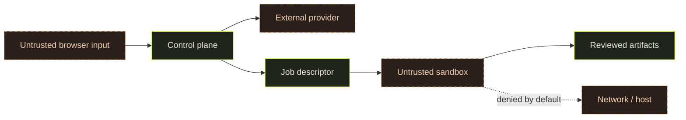

# Security model

## Current model

The canonical Next.js application includes server authorization, PostgreSQL project/source data, provider adapters and a separate local Docker worker. These are preserved implementations, not proof of hosted multi-user safety or RFC microVM containment. The default-off RFC `engine/control` service additionally preserves durable leases, approvals, accounting and synthetic source flow. It uses separate fixture identities/schema; application sessions do not authorize it.

The [demo-delivery amendment](rfcs/0001-app-generation-vertical-slice.md) includes protected BYOK and Vercel website hosting. Live credential/accounting, hosted authorization, versioned storage, private preview and isolated runtime acceptance remain open. Missing access/configuration must fail closed. Public portfolio viewing grants no generation or private project authority. Generated code never receives control, provider or deployment credentials.

## Assets

- Project briefs may contain confidential product information.
- Provider credentials authorize paid or private model access.
- Source repositories may contain proprietary code and developer secrets.
- Generated artifacts and build logs may reproduce sensitive input.
- The host and adjacent network are high-value targets for generated code.

## Trust boundaries

This diagram is a target design, not current functionality.

## Target controls

- Validate and cap all request bodies, filenames, archives, and event streams.
- Store secrets in a server-side secret manager; redact logs and diagnostics.
- Require authorization for projects, workspaces, provider use, and execution approvals.
- Create a disposable runner per job with a non-root user, minimal capabilities, resource quotas, process limits, and timeouts.
- Mount only a job-specific workspace; never mount the Docker socket, host home, or broad repository roots.
- Deny egress by default; resolve and pin approved destinations to resist SSRF and DNS rebinding.
- Treat model output and generated code as untrusted instructions and content.
- Separate plan approval from execution, and display commands and diffs before durable application.
- Produce append-only audit events without prompts, secrets, or full source snapshots by default.
- Scan dependencies and generated artifacts before preview or export.

## Non-goals

The first sandbox will not guarantee containment against kernel or container-runtime vulnerabilities. Forge cannot guarantee generated code is correct, secure, licensed appropriately, or free of embedded secrets. Human review remains required.

## Security release gate

Before enabling generation, the project needs abuse-case tests for path traversal, symlink escapes, archive bombs, command injection, prompt injection, SSRF, credential exfiltration, resource exhaustion, cross-project access, malicious dependencies, and log leakage. The threat model and deployment guide must be updated with measured controls and residual risks.

## Unified application integration
The approved neutral interface in DESIGN.md is authoritative. Five design examples are optional. Hosted authentication, cloud execution, and publishing must be verified before being described as available. See docs/implementation-status.md.
