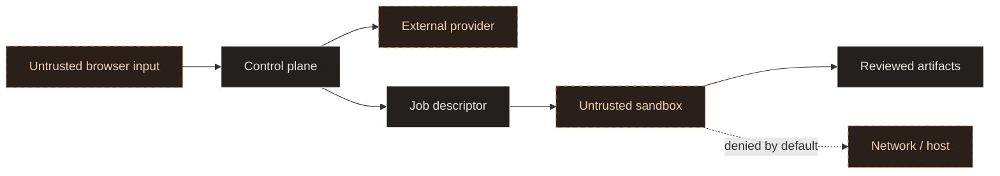

# Security model

## Current model

The frontend persists validated project briefs in browser local storage. No authentication or server project store exists. The optional loopback NVIDIA API keeps its credential on the server and sends a brief to the selected model only after an explicit Generate plan action. Responses are rendered as escaped text. There is no repository writer, shell, generated-code runner, deployment path or execution sandbox. See [NVIDIA setup](nvidia-provider.md) for the API's local-development boundary. Browser backups may contain private brief text and should be handled accordingly.

The supplied container narrows the static Nginx process with an unprivileged user, dropped capabilities, no-new-privileges, a read-only root filesystem, and controlled temporary mounts. This is deployment hardening, not workload isolation.

## Assets

- Project briefs may contain confidential product information.
- Provider credentials authorize paid or private model access.
- Source repositories may contain proprietary code and developer secrets.
- Generated artifacts and build logs may reproduce sensitive input.
- The host and adjacent network are high-value targets for generated code.

## Trust boundaries

This diagram is a target design, not current functionality.

## Target controls

- Validate and cap all request bodies, filenames, archives, and event streams.
- Store secrets in a server-side secret manager; redact logs and diagnostics.
- Require authorization for projects, workspaces, provider use, and execution approvals.
- Create a disposable runner per job with a non-root user, minimal capabilities, resource quotas, process limits, and timeouts.
- Mount only a job-specific workspace; never mount the Docker socket, host home, or broad repository roots.
- Deny egress by default; resolve and pin approved destinations to resist SSRF and DNS rebinding.
- Treat model output and generated code as untrusted instructions and content.
- Separate plan approval from execution, and display commands and diffs before durable application.
- Produce append-only audit events without prompts, secrets, or full source snapshots by default.
- Scan dependencies and generated artifacts before preview or export.

## Non-goals

The first sandbox will not guarantee containment against kernel or container-runtime vulnerabilities. Forge cannot guarantee generated code is correct, secure, licensed appropriately, or free of embedded secrets. Human review remains required.

## Security release gate

Before enabling generation, the project needs abuse-case tests for path traversal, symlink escapes, archive bombs, command injection, prompt injection, SSRF, credential exfiltration, resource exhaustion, cross-project access, malicious dependencies, and log leakage. The threat model and deployment guide must be updated with measured controls and residual risks.
